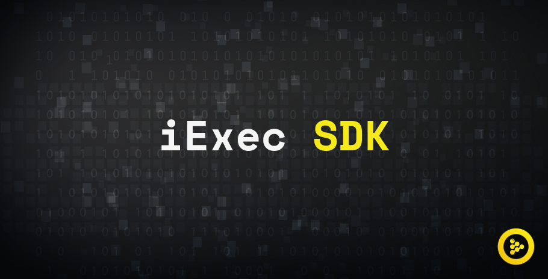

# iExec SDK V5

[](https://drone.iex.ec/iExecBlockchainComputing/iexec-sdk)
[](https://www.npmjs.com/package/iexec) [](https://www.npmjs.com/package/iexec) [](LICENSE) [](https://twitter.com/iex_ec)

The iExec SDK is a CLI and a JS library that allows easy interactions with iExec decentralized Marketplace in order to run off-chain computations.

## Resources

- [CLI tutorials](#cli-tutorials)
- [CLI documentation](#iexec-sdk-cli-api)
- [JS lib documentation](#iexec-sdk-library-api)
- [CHANGELOG](./CHANGELOG.md)
- The iExec Dapp Store: https://dapps.iex.ec
- The iExec Data Store: https://data.iex.ec
- The iExec Marketplace: https://market.iex.ec
- The iExec Explorer: https://explorer.iex.ec
- The iExec Workerpool registry: https://pools.iex.ec
- The RLC faucet: https://faucet.iex.ec
- iExec main documentation: https://docs.iex.ec
- [iExec dapps registry](https://github.com/iExecBlockchainComputing/iexec-dapps-registry), to apply for Dapp Store listing
- [iExec data registry](https://github.com/iExecBlockchainComputing/iexec-datasets-registry), to apply for Data Store listing

## Install

All three major OS are supported (linux, OSX, windows).

#### Using Nodejs

Requirements: [](https://nodejs.org/en/) and [Git](https://git-scm.com/).

```bash
npm -g install iexec # install the cli
iexec --version
iexec --help
```

#### Using Docker

Requirements: [Docker](https://docs.docker.com/install/).

```bash
# For Linux users
echo 'alias iexec='"'"'docker run -e DEBUG=$DEBUG --interactive --tty --rm -v /tmp:/tmp -v $(pwd):/iexec-project -v /home/$(whoami)/.ethereum/keystore:/home/node/.ethereum/keystore -w /iexec-project iexechub/iexec-sdk:latest'"'"'' >> ~/.bash_aliases && source ~/.bashrc
# For Mac OSX users
echo 'alias iexec='"'"'docker run -e DEBUG=$DEBUG --interactive --tty --rm -v /tmp:/tmp -v $(pwd):/iexec-project -v /Users/$(whoami)/Library/Ethereum/keystore:/home/node/.ethereum/keystore -w /iexec-project iexechub/iexec-sdk:latest'"'"'' >> ~/.bash_profile && source ~/.bash_profile
```

Now run `iexec --version` to check all is working.

## Upgrade

- **Nodejs**: run `npm -g install iexec`
- **Docker**: run `docker pull iexechub/iexec-sdk`

# Tutorials

## CLI Tutorials

- [Init project](#Init-project)
- [SDK CLI for Dapp developpers](#SDK-CLI-for-Dapp-developpers)
- [SDK CLI for Dataset providers](#SDK-CLI-for-Dataset-providers)
- [SDK CLI for Workerpools](#SDK-CLI-for-Workerpools)
- [SDK CLI for Requesters](#SDK-CLI-for-Requesters)
- [SDK CLI for workers](#SDK-CLI-for-workers)

### Init project

required steps before following any other workflow.

```bash
iexec init # create all required files
iexec wallet getETH # ask faucet for ETH, this may require manual action
iexec wallet getRLC # ask iExec faucet for RLC
iexec wallet show # show your wallet
iexec storage init # initialize your remote storage
```

> _NB:_ iExec SDK CLI access the public blockchains (mainnet & goerli) through [ethers](https://github.com/ethers-io/ethers.js/) to connect different backends ([Alchemy](https://alchemyapi.io/), [Etherscan](https://etherscan.io/), [INFURA](https://infura.io/)).
>
> Default API keys for backend services are provided for convenience.
> As these keys are shared accross all users and are subject to rate limits, **you must use your own API keys** or better **your own node**.
>
> Get API keys for backend services:
>
> - [INFURA](https://infura.io/register) ([more details on Infura's blog](https://blog.infura.io/getting-started-with-infura-28e41844cc89/))
> - [Etherscan](https://etherscan.io/apis)
> - [Alchemy](https://alchemyapi.io/signup)
>
> Once you created your access, you can add your API keys in the `chains.json` configuration file:
>
> ```json
> {
>    "default": ...,
>    "chains": { ... },
>    "providers": {
>      "infura": {
>        "projectId": "INFURA_PROJECT_ID",
>        "projectSecret": "INFURA_PROJECT_SECRET"
>       },
>     "etherscan": "ETHERSCAN_API_KEY",
>     "alchemy": "ALCHEMY_API_KEY"
>    }
> }
> ```
>
> If you run your own node, you can add an `host` key in the `chains.json` configuration file to target your node:
>
> ```json
> {
>    "default": ...,
>    "chains": {
>       ...
>       "mainnet": {
>         "id": "1",
>         "host": "http://localhost:8545"
>       },
>       "goerli": {
>         "id": "5",
>         "host": "http://localhost:58545"
>       }
>    }
> }
> ```
>
> Check your current host:
> `iexec info`

### SDK CLI for Dapp developpers

First go through [Init project](#Init-project)

#### Deploy an app

```bash
iexec app count # check if you have already deployed apps
iexec app init # reset app fields in iexec.json
iexec app deploy # deploy app on Ethereum and get an address
iexec app show # show details of deployed app
```

#### Run an app

```bash
iexec app run [address] # run an application on iExec at market price
```

#### Sell your app on the Marketplace

```bash
iexec orderbook app <address> # check if you have valid sell orders for your app on the Marketplace
iexec app publish [address] # publish an apporder on the Marketplace and get an orderHash
iexec order show --app [orderHash] # show your order on the Marketplace
iexec order cancel --app <orderHash> # cancel your order
```

### SDK CLI for Dataset providers

First go through [Init project](#Init-project)

#### Encrypt your dataset

```bash
cp 'myAwsomeDataset.file' ./datasets/original # copy your dataset file or folder into the dataset/original/ folder
iexec dataset encrypt # generate a secret key for each file or folder in dataset/original/ and encrypt it, also output the encrypted file checksum to use for deployment.
cat ./.secrets/dataset/myAwsomeDataset.file.secret # this is the secret key for decrypting the dataset
cat ./datasets/encrypted/myAwsomeDataset.file.enc # this is the encrypted dataset, you must share this file at a public url
```

#### Deploy your dataset

```bash
iexec dataset count # check if you have already deployed datasets
iexec dataset init # reset dataset fields in iexec.json
iexec dataset deploy # deploy dataset on Ethereum
iexec dataset show # show details of deployed dataset
```

### Securely share the dataset secret key

**Disclaimer: The secrets pushed in the Secreet Management Service will be shared with the worker to process the dataset in the therms your specify in the dataset order. Make sure to always double check your selling policy in the dataset order before signing it**

```bash
iexec dataset push-secret # Push the secret in the Secret Management Service (sms)
```

#### Sell your dataset on the Marketplace

```bash
iexec orderbook dataset <address> # check if you have valid sell orders for your dataset on the Marketplace
iexec dataset publish [address] --tag tee --app-restrict <address> # publish a datasetorder (restricted to specific app running in Trusted Execution Environment) on the Marketplace and get an orderHash
iexec order show --dataset [orderHash] # show your order on the Marketplace
iexec order cancel --dataset <orderHash> # cancel your order
```

### SDK CLI for Workerpools

First go through [Init project](#Init-project)

#### Deploy a workerpool

```bash
iexec workerpool count # check if you have already deployed workerpools
iexec workerpool init # reset workerpool fields in iexec.json
iexec workerpool deploy # deploy workerpool on Ethereum
iexec workerpool show # show details of deployed workerpool
```

#### Sell your computing power at limit price on the Marketplace

```bash
iexec orderbook workerpool [address] --category <id> # check if you have valid sell orders for your workerpool on the Marketplace
iexec publish workerpool # publish a workerpoolorder on the Marketplace and get an orderHash
iexec order cancel --workerpool <orderHash> # cancel your order
```

#### Sell your computing power at market price on the Marketplace

```bash
iexec orderbook requester --category <id> # find a requestorder ask you want to fill in your category
iexec orderbook app <address> #  find a compatible apporder
iexec orderbook dataset <address> #  find a compatible datasetorder
iexec order init --workerpool # reset workerpoolorder fields in iexec.json
iexec order sign --workerpool # sign your workerpoolorder
iexec order fill --request <orderHash> --app <orderHash> --dataset <orderHash> # send the orders and get a dealid
iexec deal show <dealid> # show the detail of the deal you concludes
```

### SDK CLI for Requesters

First go through [Init project](#Init-project)

#### Top up your iExec account to buy compution

```bash
iexec account show # show your iExec account
iexec account deposit 200 # deposit RLC from your wallet to your account
iexec account show # make sure you have enough staked RCL to buy computation
```

#### Buy computation at market price on the Marketplace

```bash
iexec app run [address] [--dataset [address] --args <args> --category <id>] # run an iExec application at market price
```

see [app run available options](#app-run)

#### Or Buy computation at limit price on the Marketplace

```bash
iexec app request-execution [address] [--dataset [address] --args <args> --category <id>] # publish a requestorder on the Marketplace and get an orderHash
iexec order show --app <orderHash> --deals # show your order on the Marketplace and check the deals
```

#### Watch your Deals, your Tasks and download the results

```bash
iexec deal show <dealid> # show your deal details, get the taskids
iexec task show <taskid> # show the status of your task
iexec task show <taskid> --watch # wait until the task is COMPLETED or FAILED
iexec task show <taskid> --download [fileName] # download the result of your COMPLETED task
```

#### Use results encryption

```bash
iexec result generate-encryption-keypair # generate private/public RSA keypair for result encryption
iexec result push-encryption-key # share the public RSA key with the secret management service, all your results will be encrypted with this key
# Go through the normal buy process  and download the result of the computation #
iexec result decrypt [encryptedResultsFilePath] # decrypt the result with the private RSA key
```

### SDK CLI for workers

First go through [Init project](#Init-project)

#### Top up your iExec account to buy compution

```bash
iexec account deposit 200 # deposit RLC from your wallet to your account
iexec account show # make sure you have enough stake to join a workerpool
```

#### Withdraw your working reward

```bash
iexec account show # view your available stake
iexec account withdraw 1000 # withdraw RLC from your account to your wallet
```

# iExec SDK CLI API

- [Help & Info](#help--info)
- [Global options](#global-options)
  - [Wallet options](#wallet-options)
  - [Transactions options](#Transactions-options)
- CLI commands
  - [init](#init)
  - [wallet](#wallet)
  - [account](#account)
  - [app](#app)
  - [dataset](#dataset)
  - [workerpool](#workerpool)
  - [order](#order)
  - [orderbook](#orderbook)
  - [deal](#deal)
  - [task](#task)
  - [storage](#storage)
  - [result](#result)
  - [category](#category)
  - [registry](#registry)
- [CLI files and folders](#cli-files-and-folders)

## Help & Info

```bash
iexec --version
iexec --help
iexec app --help
iexec orderbook --help
iexec info --chain goerli
```

## Global options

```bash
--quiet # disable update notification
--raw # display the command result as a json (disable update notification)
```

### Wallet options

```bash
--keystoredir <'global'|'local'|customPath> # specify the location of the keystoredir
--wallet-address <address> # specify which wallet to use in the keystore
--wallet-file <fileName> # specify which wallet to use in the keystore
--password <password> # specify the password for unlocking the wallet (not recommended)
```

### Transactions options

```bash
--gas-price <amount> [unit] # use the specified value (in wei or specified unit) for next transactions gas price (default use eth_gasPrice current value)
--confirms <blockCount> # set custom block count to wait for transactions confirmation (default 1 block)
```

## init

```bash
iexec init # create all files necessary to get started
iexec init --skip-wallet # skip the wallet creation step
```

## wallet

```bash
# OPTIONS
# --chain <chainName>
# --to <address>
# --force
# --password <password>
iexec wallet create # create a new encrypted wallet
iexec wallet create --unencrypted # create unencrypted wallet.json (not recommended)
iexec wallet import <privateKey> # create an encrypted wallet from a privateKey
iexec wallet getETH # ask ETH from faucets
iexec wallet getRLC # ask RLC from faucets
iexec wallet show [address] # optional address to show other people's wallet
iexec wallet show --show-private-key # allow displaying wallet private key
iexec wallet sendETH <amount> [unit] --to <address> # send ether amount (in ether or specified unit) to the specified eth address
iexec wallet sendRLC <amount> [unit] --to <address>  # send RLC amount (in nRLC or specified unit) to the specified eth address
iexec wallet sweep --to <address> # drain all ether and RLC, sending them to the specified eth address
iexec wallet bridge-to-sidechain <amount> [unit] # send RLC amount (in nRLC or specified unit) from a mainchain to the bridged sidechain.
iexec wallet bridge-to-mainchain <amount> [unit] # send RLC amount (in nRLC or specified unit) from a sidechain to the bridged mainchain.
iexec wallet swap-RLC-for-eRLC <amount> [unit] # swap RLC for the same amount of eRLC (default unit nRLC) - the wallet must be authorized to interact with eRLC.
iexec wallet swap-eRLC-for-RLC <amount> [unit] # swap eRLC for the same amount of RLC (default unit neRLC) - the wallet must be authorized to interact with eRLC.
```

The wallet files are stored in the Ethereum keystore.
The keystore location depends on your OS:

- Linux : ~/.ethereum/keystore
- Mac: ~/Library/Ethereum/keystore
- Windows: ~/AppData/Roaming/Ethereum/keystore

## account

```bash
# OPTIONS
# --chain <chainName>
# --force
iexec account show [address] # optional address to show other people's account
iexec account deposit <amount> [unit] # deposit the specified amount of RLC (in nRLC or specified unit) from your wallet to your account
iexec account withdraw <amount> [unit] # withdraw the specified amount of RLC  (in nRLC or specified unit) from your account to your wallet
```

## app

```bash
# OPTIONS
# --chain <chainName>
# --user <address>
iexec app init # init the app template
iexec app init --tee # init the TEE app template
iexec app deploy # deploy the app on the blockchain
iexec app publish [address] # publish an apporder to make your app publicly available on the marketplace (use options to manage access)
iexec app unpublish [address] # unpublish the last published apporder for specified app
iexec app unpublish [address] --all # unpublish all the published apporders for specified app
iexec app show [address|index] # show app details
iexec app count # count your total number of app
iexec app count --user <userAddress> # count user total number of app
```

### app run

```bash
iexec app run [appAddress] [options] # run an iExec application at market price (default run last deployed app)
# OPTIONS
--dataset <address|"deployed"> # dataset address, use "deployed" to use last deployed from "deployed.json"
--workerpool <address|"deployed"> # workerpool address, use "deployed" to use last deployed from "deployed.json"
--category <id> # id of the task category
--tag <tag...> # specify tags (usage: --tag tee,gpu)
--trust <integer> # trust level
--beneficiary <address> # specify the beneficiary of the request (default user address)
--callback <address> # specify the callback address of the request
--args <string> # specify the arguments to pass to the app
--input-files <fileUrl...> # specify the URL of input files to be used by the app (usage: --input-files https://example.com/foo.txt,https://example.com/bar.zip)
--encrypt-result # encrypt the result archive with the beneficiary public key
--storage-provider <"ipfs"|"dropbox"> # specify the storage to use to store the result archive
--skip-request-check # skip request validity checks, this may result in task execution fail
--params <json> # specify the params of the request, this option is reserved to an advanced usage (usage: --params '{"iexec_args":"dostuff","iexec_input_files":["https://example.com/file.zip"]}')
--watch # watch execution status changes
```

### app request-execution

```bash
iexec app request-execution <appAddress> [options] # request an iExec application execution at limit price
# OPTIONS
--dataset <address> # dataset address
--workerpool <address> # workerpool address
--app-price <amount unit...> # app price per task (default unit nRLC)
--dataset-price <amount unit...> # dataset price per task (default unit nRLC)
--workerpool-price <amount unit...> # workerpool price per task (default unit nRLC)
--category <id> # id of the task category
--tag <tag...> # specify tags (usage: --tag tee,gpu)
--trust <integer> # trust level
--beneficiary <address> # specify the beneficiary of the request (default user address)
--callback <address> # specify the callback address of the request
--args <string> # specify the arguments to pass to the app
--input-files <fileUrl...> # specify the URL of input files to be used by the app (usage: --input-files https://example.com/foo.txt,https://example.com/bar.zip)
--encrypt-result # encrypt the result archive with the beneficiary public key
--storage-provider <"ipfs"|"dropbox"> # specify the storage to use to store the result archive
--skip-request-check # skip request validity checks, this may result in task execution fail
--params <json> # specify the params of the request, this option is reserved to an advanced usage (usage: --params '{"iexec_args":"dostuff","iexec_input_files":["https://example.com/file.zip"]}')
```

## dataset

```bash
# OPTIONS
# --chain <chainName>
# --user <address>
iexec dataset init # init the dataset template
iexec dataset init --tee # init the dataset template and create the folders for dataset encryption
iexec dataset encrypt # for each dataset file in ./datasets/original/ generate a 256 bits key and encrypt the dataset using AES-256-CBC and compute the encrypted file's sha256 checksum
iexec dataset deploy # deploy the dataset on the blockchain
iexec dataset push-secret [datasetAddress] # push the key for the encrypted dataset
iexec dataset check-secret [datasetAddress] # check if a secret exists for the dataset
iexec dataset publish [datasetAddress] # publish an datasetorder to make your dataset publicly available on the marketplace (use options to manage access)
iexec dataset unpublish [datasetAddress] # unpublish the last published datasetorder for specified dataset
iexec dataset unpublish [datasetAddress] --all # unpublish all the published datasetorders for specified dataset
iexec dataset show [address|index] # show dataset details
iexec dataset count # count your total number of dataset
iexec dataset count --user <userAddress> # count user total number of dataset
```

## workerpool

```bash
# OPTIONS
# --chain <chainName>
# --user <address>
iexec workerpool init # init the workerpool template
iexec workerpool deploy # deploy the workerpool on the blockchain
iexec workerpool publish [workerpoolAddress] --price <amount> [unit] # publish an workerpoolorder to make your workerpool computing power publicly available on the marketplace
iexec workerpool unpublish [workerpoolAddress] # unpublish the last published workerpoolorder for specified workerpool
iexec workerpool unpublish [workerpoolAddress] --all # unpublish all the published workerpoolorders for specified workerpool
iexec workerpool show [address|index] # show workerpool details
iexec workerpool count # count your total number of workerpool
iexec workerpool count --user <userAddress> # count user total number of workerpool
```

## order

```bash
# OPTIONS
# --chain <chainName>
# --force
iexec order init # init all kind of orders
iexec order init --app --dataset --workerpool --request # specify the kind of order to init
iexec order sign # sign all initialized orders
iexec order sign --app --dataset --workerpool --request # sign the specific initialized orders
iexec order publish --app --dataset --workerpool --request # publish the specific signed orders on iExec Marketplace
iexec order show --app [orderHash] --dataset [orderHash] --workerpool [orderHash] --request [orderHash] # show the specified published order from iExec Marketplace
iexec order show --request [orderHash] --deals # show the deals produced by an order
iexec order fill # fill a set of local signed orders (app + dataset + workerpool + request) and return a dealid
iexec order fill --app <orderHash> --dataset <orderHash> --workerpool <orderHash> --request <orderHash> # fill a set of signed orders from iExec Marketplace and return a dealid
iexec order fill --params <params> # fill a set of signed orders generate a request order with specified params on the fly (existing apporder is ignored)
iexec order cancel --app --dataset --workerpool --request # cancel a specific signed order
iexec order unpublish --app [orderHash] --dataset [orderHash] --workerpool [orderHash] --request [orderHash] # unpublish a specific published order from iExec Marketplace (unpublished orders are still valid in the PoCo, to invalidate them use cancel)
```

## orderbook

```bash
# OPTIONS
# --chain <chainName>
iexec orderbook requester --category <id> # show the best requestorders published on the Marketplace for the specified category
iexec orderbook requester [address] --category <id> # filters the result on requester
iexec orderbook workerpool --category <id> # show the best workerpools published on the Marketplace for the specified category
iexec orderbook workerpool [address] --category <id> # filters the result on workerpool
iexec orderbook workerpool --category <id> --require-tag <...tags> # show the best workerpools published on the Marketplace matchin the specified tags
iexec orderbook app <address> # show the best apporders published on the Marketplace for the specified app
iexec orderbook app <address> --dataset <address> --requester <address> --workerpool <address> # filter on specific dataset, requester, workerpool
iexec orderbook dataset <address> # show the best datasetorders published on the Marketplace for the specified dataset
iexec orderbook dataset <address> --app <address> --requester <address> --workerpool <address> # filter on specific app, requester, workerpool
```

## deal

```bash
# OPTIONS
# ---chain <chainName>
iexec deal show <dealid> # show a deal identified by dealid
iexec deal claim <dealid> # claim all failed tasks from a deal
```

## task

```bash
# OPTIONS
# --chain <chainName>
iexec task show <taskid> # show task identified by taskid
iexec task show <taskid> --watch # wait for task to be COMPLETED or CLAIMED
iexec task show <taskid> --download [fileName] # download the result of a COMPLETED task
iexec task show <taskid> --download [fileName] --decrypt # download and decrypt the result of a COMPLETED task
iexec task claim <taskid> # claim a task requested by the user if the final deadline is reached and the task is still not COMPLETED
```

## result

```bash
# OPTIONS
# --chain <chainName>
iexec result generate-encryption-keypair # generate a beneficiary keypair to encrypt and decrypt the results
iexec result push-encryption-key # push the encryption key for the beneficiary
iexec result push-encryption-key --force-update # push the encryption key for the beneficiary, update if exists
iexec result push-encryption-key --secret-file [secretPath] # specify a file path for reading the secret
iexec result decrypt [encryptedResultsPath] # decrypt encrypted results with beneficary key
iexec result check-encryption-key [userAddress] # check if a encryption key exists for the user
```

## storage

```bash
# OPTIONS
# --chain <chainName>
iexec storage init # initialize the IPFS based default remote storage
iexec storage init [provider] # initialize the specified remote storage (supported "default"|"dropbox")
iexec storage check [provider] # check if the specified remote storage is initialized
iexec storage check [provider] --user <address> # check if the remote storage of specified user is initialized
```

## category

```bash
# OPTIONS
# --chain <chainName>
iexec category init # init the category template
iexec category create # create new category
iexec category show <index> # show category details by index
iexec category count # count total number of category
```

## registry

```bash
iexec registry validate <'app'|'dataset'|'workerpool'> # validate an object before submitting it to the iExec registry and be listed in the iExec stores
```

## CLI files and folders

- [iexec.json](#iexecjson)
- [chain.json](#chainjson)
- [orders.json](#ordersjson)
- [deployed.json](#deployedjson)
- [.secrets/](#secrets)
  - [.secrets/datasets/](#secretsdatasets)
  - [.secrets/beneficary/](#secretsbeneficiary)
- [datasets/](#datasets)
  - [datasets/original/](#datasetsoriginal)
  - [datasets/encrypted/](#datasetsencrypted)

### iexec.json

The `iexec.json` file, located in every iExec project, describes the parameters used when creating a [app|dataset|category|workerpool], or when signing an order.

```json
{
  "app": {
    "owner": "0xF048eF3d7E3B33A465E0599E641BB29421f7Df92",
    "name": "VanityGen",
    "type": "DOCKER",
    "multiaddr": "registry.hub.docker.com/iexechub/vanitygen:1.0.0",
    "checksum": "0x762a451c05e0d8097b35d6376e748798b5dc6a13290439cf67d5202f7c6f695f"
  },
  "dataset": {
    "owner": "0xF048eF3d7E3B33A465E0599E641BB29421f7Df92",
    "name": "my-dataset",
    "multiaddr": "/ipfs/QmW2WQi7j6c7UgJTarActp7tDNikE4B2qXtFCfLPdsgaTQ",
    "checksum": "0x0000000000000000000000000000000000000000000000000000000000000000"
  },
  "workerpool": {
    "owner": "0xF048eF3d7E3B33A465E0599E641BB29421f7Df92",
    "description": "my workerpool"
  },
  "category": {
    "name": "CAT1",
    "description": "my category N°1",
    "workClockTimeRef": 100
  },
  "order": {
    "apporder": {
      "app": "0x0000000000000000000000000000000000000000",
      "appprice": "0",
      "volume": "1",
      "tag": "0x0000000000000000000000000000000000000000000000000000000000000000",
      "datasetrestrict": "0x0000000000000000000000000000000000000000",
      "workerpoolrestrict": "0x0000000000000000000000000000000000000000",
      "requesterrestrict": "0x0000000000000000000000000000000000000000"
    },
    "datasetorder": {
      "dataset": "0x0000000000000000000000000000000000000000",
      "datasetprice": "0",
      "volume": "1",
      "tag": "0x0000000000000000000000000000000000000000000000000000000000000000",
      "apprestrict": "0x0000000000000000000000000000000000000000",
      "workerpoolrestrict": "0x0000000000000000000000000000000000000000",
      "requesterrestrict": "0x0000000000000000000000000000000000000000"
    },
    "workerpoolorder": {
      "workerpool": "0x0000000000000000000000000000000000000000",
      "workerpoolprice": "0",
      "volume": "1",
      "category": "1",
      "trust": "100",
      "tag": "0x0000000000000000000000000000000000000000000000000000000000000000",
      "apprestrict": "0x0000000000000000000000000000000000000000",
      "datasetrestrict": "0x0000000000000000000000000000000000000000",
      "requesterrestrict": "0x0000000000000000000000000000000000000000"
    },
    "requestorder": {
      "app": "0x0000000000000000000000000000000000000000",
      "appmaxprice": "0",
      "dataset": "0x0000000000000000000000000000000000000000",
      "datasetmaxprice": "0",
      "workerpool": "0x0000000000000000000000000000000000000000",
      "workerpoolmaxprice": "0",
      "volume": "1",
      "category": "1",
      "trust": "100",
      "tag": "0x0000000000000000000000000000000000000000000000000000000000000000",
      "beneficiary": "0x0000000000000000000000000000000000000000",
      "callback": "0x0000000000000000000000000000000000000000",
      "params": "{ cmdline: '--help' }"
    }
  }
}
```

### chain.json

The `chain.json` file, located in every iExec project, describes the parameters used when communicating with ethereum nodes and iExec Secret Management Services. They are ordered by chain name, accessible by using the `--chain <chainName>` option for each command of the SDK.

- `default` set the default chain used by the SDK cli.
- `chains` set the available chains
  - optional key `host` set the url of the ethereum node used by the SDK cli on each chain (overwrite default value).
  - optional key `hub` set the address of the hub used by the SDK cli on each chain (overwrite default value).
  - optional key `sms` set the url of the Secret Management Service used by the SDK cli on each chain (overwrite default value).
  - optional key `resultProxy` set the url of the Result Proxy used by the SDK cli on each chain (overwrite default value).
  - optional key `ipfsGateway` set the url of the IPFS gateway used by the SDK cli on each chain (overwrite default value).
  - optional key `bridge` set the bridge used by the SDK cli when working with bridged networks (sidechain). `bridge.contract` set the address of the RLC bridge on the chain, `bridge.bridgedChainName` set the reference to the bridged network.
  - optional key `enterprise` set the enterprise swap contract used by the SDK cli when working with enterprise enabled networks. `bridge.enterpriseSwapChainName` set the reference to the enterprise bound network.
  - optional key `native` specify whether or not the chain native token is RLC (overwrite default value: chain value or `false`).
  - optional key `useGas` specify whether or not the chain requires to spend gas to send a transaction (overwrite default value: chain value or `true`).
- optional key `providers` set the backends for public chains
  - optional key `alchemy` set Alchemy API Token
  - optional key `etherscan` set Etherscan API Token
  - optional key `infura` set INFURA Project ID or ProjectID and Project Secret
  - optional key `quorum` set minimum number of backends that must agree before forwarding blockchain responses

```json
{
  "default": "goerli",
  "chains": {
    "dev": {
      "host": "http://localhost:8545",
      "id": "65535",
      "sms": "http://localhost:5000",
      "resultProxy": "http://localhost:8089",
      "ipfsGateway": "http://localhost:8080",
      "flavour": "standard",
      "hub": "0xC129e7917b7c7DeDfAa5Fff1FB18d5D7050fE8ca",
      "bridge": {
        "contract": "0x1e32aFA55854B6c015D284E3ccA9aA5a463A1418",
        "bridgedChainName": "dev-sidechain"
      },
      "enterprise": {
        "enterpriseSwapChainName": "dev-enterprise"
      }
    },
    "dev-sidechain": {
      "host": "http://localhost:18545",
      "id": "123456",
      "sms": "http://localhost:15000",
      "resultProxy": "http://localhost:18089",
      "ipfsGateway": "http://localhost:18080",
      "native": true,
      "useGas": false,
      "flavour": "standard",
      "hub": "0xC129e7917b7c7DeDfAa5Fff1FB18d5D7050fE8ca",
      "bridge": {
        "contract": "0x1e32aFA55854B6c015D284E3ccA9aA5a463A1418",
        "bridgedChainName": "development"
      }
    },
    "dev-enterprise": {
      "host": "http://localhost:8545",
      "id": "65535",
      "sms": "http://localhost:5000",
      "resultProxy": "http://localhost:8089",
      "ipfsGateway": "http://localhost:8080",
      "flavour": "enterprise",
      "hub": "0xb80C02d24791fA92fA8983f15390274698A75D23",
      "enterprise": {
        "enterpriseSwapChainName": "dev"
      }
    },
    "goerli": {},
    "mainnet": {},
    "bellecour": {},
    "enterprise": {}
  },
  "providers": {
    "alchemy": "ALCHEMY_API_KEY",
    "etherscan": "ETHERSCAN_API_KEY",
    "infura": {
      "projectId": "INFURA_PROJECT_ID",
      "projectSecret": "INFURA_PROJECT_SECRET"
    },
    "quorum": 1
  }
}
```

### deployed.json

The `deployed.json` file, located in iExec project, locally stores your latest deployed resources address. These address are used when you run a command without specifying a resource address (exemple: `iexec app show` will show the app in `deployed.json`).

```json
{
  "app": {
    "42": "0xa760FEfAd0a38D494890501120cB79f5EEAFeE28"
  },
  "workerpool": {
    "42": "0xFb346A453C4D34AbA0038c274D1bd3C98099962c"
  },
  "dataset": {
    "42": "0xB9c7647ECd48d795A9031d6fe8292C13E73372F7"
  }
}
```

### orders.json

The `orders.json` file, located in iExec project, locally stores your latest signed orders. This file is used when you publish an order on the Marketplace and when you fill orders without specified orders from the Marketplace.

```json
{
  "42": {
    "apporder": {
      "app": "0x0000000000000000000000000000000000000000",
      "appprice": "0",
      "volume": "1",
      "tag": "0x0000000000000000000000000000000000000000000000000000000000000000",
      "datasetrestrict": "0x0000000000000000000000000000000000000000",
      "workerpoolrestrict": "0x0000000000000000000000000000000000000000",
      "requesterrestrict": "0x0000000000000000000000000000000000000000",
      "salt": "0x0000000000000000000000000000000000000000000000000000000000000000",
      "sign": "0x"
    },
    "datasetorder": {
      "dataset": "0x0000000000000000000000000000000000000000",
      "datasetprice": "0",
      "volume": "1",
      "tag": "0x0000000000000000000000000000000000000000000000000000000000000000",
      "apprestrict": "0x0000000000000000000000000000000000000000",
      "workerpoolrestrict": "0x0000000000000000000000000000000000000000",
      "requesterrestrict": "0x0000000000000000000000000000000000000000",
      "salt": "0x0000000000000000000000000000000000000000000000000000000000000000",
      "sign": "0x"
    },
    "workerpoolorder": {
      "workerpool": "0x0000000000000000000000000000000000000000",
      "workerpoolprice": "0",
      "volume": "1",
      "category": "1",
      "trust": "100",
      "tag": "0x0000000000000000000000000000000000000000000000000000000000000000",
      "apprestrict": "0x0000000000000000000000000000000000000000",
      "datasetrestrict": "0x0000000000000000000000000000000000000000",
      "requesterrestrict": "0x0000000000000000000000000000000000000000",
      "salt": "0x0000000000000000000000000000000000000000000000000000000000000000",
      "sign": "0x"
    },
    "requestorder": {
      "app": "0x0000000000000000000000000000000000000000",
      "appmaxprice": "0",
      "dataset": "0x0000000000000000000000000000000000000000",
      "datasetmaxprice": "0",
      "workerpool": "0x0000000000000000000000000000000000000000",
      "workerpoolmaxprice": "0",
      "volume": "1",
      "category": "1",
      "trust": "100",
      "tag": "0x0000000000000000000000000000000000000000000000000000000000000000",
      "beneficiary": "0x0000000000000000000000000000000000000000",
      "callback": "0x0000000000000000000000000000000000000000",
      "params": "--help",
      "requester": "0x0000000000000000000000000000000000000000",
      "salt": "0x0000000000000000000000000000000000000000000000000000000000000000",
      "sign": "0x"
    }
  }
}
```

### ./secrets/

This folder is created when running `iexec result generate-encryption-keypair` or `ìexec dataset init --tee` and is intended to store credentials generated by the iexec SDK CLI.

#### ./secrets/beneficiary/

This folder stores the keypair to use for result encryption and decryption.
A keypair is generated when running `iexec result generate-encryption-keypair`
Public keys name follow the pattern _userAddress_\_key.pub , this key is shared with the workers when running `ìexec result push-encryption-key`
Private keys name follow the pattern _userAddress_\_key this should never be shared with third party, the private key is used by the SDK CLI to decrypt a result when running `ìexec result decrypt`.

#### ./secrets/datasets/

This folder stores the AES keys used for dataset encryption.
A key is generated for each dataset file when running `iexec dataset encrypt`.
The key file is named after the dataset file name, last key generated is also stored in `./secrets/datasets/dataset.key` to be used as default secret to share with workers when running `iexec dataset push-secret`.

### ./datasets/

This folder is created when running `ìexec dataset init --tee` and is intended to store datasets files.

#### ./datasets/original/

Paste your original dataset files in this folder and run `iexec dataset encrypt` to encrypt them.

#### ./datasets/encrypted/

This folder stores the encrypted datasets files.
An encrypted dataset file is created for each dataset file when running `iexec dataset encrypt`.
The encrypted dataset file is named after the dataset file name.
The encrypted dataset files must be upload on a public file system and referenced in multriaddr when running `iexec dataset deploy`.

# iExec SDK Library API

## Test iexec in codesandbox

- [Buy computation demo](https://codesandbox.io/embed/iexec-sdk-demo-iexec52x-uy8tc?fontsize=14&hidenavigation=1&theme=dark)
- [Deploy and sell application demo](https://codesandbox.io/embed/app-management-iexec52x-q9qbg?fontsize=14&hidenavigation=1&theme=dark)
- [Deploy and sell dataset demo](https://codesandbox.io/embed/dataset-management-iexec52x-4me7q?fontsize=14&hidenavigation=1&theme=dark)

## These dapps are built on the top of iexec SDK

- [Price feed DOracle](https://price-feed-doracle.iex.ec/): a decentralized price oracle for your favorite cryptos.

## How to use ?

1. [Install the dependency in your JS project](#install-the-dependency-in-your-js-project)
2. [Instanciate the iExec SDK](#instanciate-the-iexec-sdk)
3. [Use iexec sdk](#use-iexec-sdk)
4. [Utils](#utils)
5. [Types](#types)
6. [Errors](#errors)

### Install the dependency in your JS project

Install iexec sdk

```bash
npm install iexec
```

### Instanciate the iExec SDK

#### IExec Constructor

**new IExec ({ ethProvider: Web3SignerProvider, flavour: 'standard'|'enterprise'|undefined } \[, options \])** => **IExec**

> _options:_
>
> - `hubAddress: Address` specify the address of iExec hub smart contract to use
> - `smsURL: URL` specify the Secret Management System to use
> - `resultProxyURL: URL` specify the result proxy to use for results remote storage
> - `ipfsGatewayURL: URL` specify the IPFS gateway to use
> - `isNative: Boolean` true when the RLC is the chain native token
> - `useGas: Boolean` false when the chain does NOT requires to spend gas to send a transaction
> - `confirms: Number` confirmations block count to wait for each transaction (must be positive, default 1)
> - `bridgeAddress: Address` specify the bridge smart contract on current chain to transfert RLC to a bridged chain
> - `bridgedNetworkConf: { rpcURL: URL, chainId: String, hubAddress: Address, bridgeAddress: Address }` specify how to connect to the bridged chain
> - `enterpriseSwapConf: { hubAddress: Address }` specify enterprise flavour binding

##### Basic configuration

_Example:_

```js
import { IExec } from 'iexec';

const iexec = new IExec({
  ethProvider: ethProvider, // an eth signer provider like MetaMask
});
```

**Important:** if the current network change, you must reinstanciate the iExec SDK (actual supported networks are '1' (ethereum mainnet), '5' (goerli testnet), '134' (iExec sidechain), '133' (iExec test sidechain)).

**Important:** ethProvider must implement eth_signTypedData_v3 (EIP712)

In the browser, you can get a signer provider from [MetaMask plugin](https://metamask.io/)

In the server side, use [utils.getSignerFromPrivateKey](#getSignerFromPrivateKey)

_Example:_

```js
const getIExec = async () => {
  let ethProvider;
  if (!window.ethereum)
    // check existing web3 provider
    throw Error('Need to install MetaMask');
  ethProvider = window.ethereum;
  try {
    await window.ethereum.enable(); // prompt the use to grant the dapp access to the blockchain
  } catch (error) {
    throw Error('User denied access', error);
  }
  return new IExec({
    ethProvider: ethProvider,
  });
};
```

##### Sidechain configuration

###### Adding iExec sidechain to MetaMask

Click `Custom RPC` in the MetaMask Networks dropdown and fill with the following values:

- Network Name: Bellecour (iExec sidechain)
- New RPC URL: https://bellecour.iex.ec
- ChainID (optional): 134
- Symbol (optional): xRLC
- Block Explorer URL (optional): https://blockscout-bellecour.iex.ec

###### Connecting iExec SDK to iExec sidechain

If you intend to use iExec SDK on a RLC native chain (ie: RLC is the native token), you must use `isNative` option.
_NB:_ Default values are provided on well known native networks such iExec test sidechain `133` and iExec mainnet sidechain `134`.

_Example:_

```js
import { IExec } from 'iexec';

const iexec = new IExec(
  {
    ethProvider: ethProvider, // an eth signer provider like MetaMask connected to https://bellecour.iex.ec
  },
  {
    isNative: true, // iExec sidechain use RLC as native token
  },
);
```

##### Bridge configuration

If you intend to bridge RLC from a chain to another (mainchain to sidechain or sidechain to mainchain), you must set `bridgeAddress` and `bridgedNetwork` options.

_Example:_

```js
import { IExec } from 'iexec';

const bridgeAddress = '0x...'; // Address of the RLC bridge smart contract on mainnet

const bridgedNetworkConf = {
  chainId: '134', // id of the bridged chain (134 for iExec sidechain)
  hubAddress: '0x...', // Address of theiExec hub smart contract on bridged chain
  rpcURL: 'https://bellecour.iex.ec', // url of a public node of bridged chain
  bridgeAddress: '0x...'; // Address of the RLC bridge smart contract on bridged chain
};

const iexec = new IExec({
  ethProvider: ethProvider, // an eth signer provider like MetaMask
}, {
  bridgeAddress,
  bridgedNetworkConf
});
```

### Use iexec sdk

- [wallet](#iexecwallet): manage your wallet, send RLC...
- [account](#iexecaccount): manage your account, deposit, withdraw...
- [app](#iexecapp): deploy a new app, show an existing one
- [dataset](#iexecdataset): deploy a new dataset, show an existing one
- [workerpool](#iexecworkerpool): deploy a new workerpool, show an existing one
- [order](#iexecorder): manage any type of order, make deals to start offchain computation
- [orderbook](#iexecorderbook): explore the iexec Marketplace
- [deal](#iexecdeal): find your deals
- [task](#iexectask): follow the computation, download results or claim failed executions
- [result](#iexecresult): manage the results encryption
- [storage](#iexecstorage): manage the remote storage
- [network](#iexecnetwork): useful information about the chain

### iexec.wallet

#### getAddress

iexec.**wallet.getAddress ( )** => Promise < **Address** >

> get the user selected address

_Example:_

```js
const userAddress = await iexec.wallet.getAddress();
console.log('User address:', userAddress);
```

#### checkBalances

iexec.**wallet.checkBalances ( address: Address )** => Promise < **{ nRLC: BN, wei: BN }** >

> check the wallet balance of specified address

_Example:_

```js
const balance = await iexec.wallet.checkBalances(ethAddress);
console.log('Nano RLC:', balance.nRLC.toString());
console.log('Eth wei:', balance.wei.toString());
```

#### sendRLC

iexec.**wallet.sendRLC ( nRlcAmount: NRlcAmount, address: Address )** => Promise < **TxHash** >

> send some nRLC (1 nRLC = 1\*10^-9 RLC) to the specified address

_Example:_

```js
const txHash = await iexec.wallet.sendRLC(nRlcAmount, toEthAddress);
console.log('Transaction hash:', txHash);
```

#### sendETH

iexec.**wallet.sendETH ( weiAmount: WeiAmount, address: Address )** => Promise < **TxHash** >

> send some wei to the specified address

_Example:_

```js
const txHash = await iexec.wallet.sendETH(weiAmount, toEthAddress);
console.log('Transaction hash:', txHash);
```

#### sweep

iexec.**wallet.sweep ( address: Address )** => Promise < **{ sendNativeTxHash: TxHash, sendERC20TxHash: TxHash, errors }**

> send all the RLC ERC20 (if applicable) and the native token to the specified address

_Example:_

```js
await sdk.wallet.sweep(toEthAddress);
```

#### bridgeToSidechain

iexec.**wallet.bridgeToSidechain ( amount: NRlcAmount )** => Promise < **{ sendTxHash: TxHash \[, receiveTxHash: TxHash \] }**

> send some nRLC (1 nRLC = 1\*10^-9 RLC) to the sidechain.
> RLC is send to the mainchain bridge smart contract on mainchain then credited on sidechain by the sidechain bridge smart contract
> The optional `bridgeAddress` is required
> The optional `bridgedNetworkConf` is required to get the `receiveTxHash` confirmation from the sidechain, if not set `receiveTxHash` will be `undefined`
> see [Bridge configuration](#Bridge-configuration)

_Example:_

```js
const { sendTxHash, receiveTxHash } = await sdk.wallet.bridgeToSidechain(
  '1000000000',
);
console.log(
  `Sent RLC on mainchain (tx: ${sendTxHash}), wallet credited on sidechain (tx: ${receiveTxHash})`,
);
```

#### bridgeToMainchain

iexec.**wallet.bridgeToMainchain ( amount: NRlcAmount )** => Promise < **{ sendTxHash: TxHash \[, receiveTxHash: TxHash \] }**

> send some nRLC (1 nRLC = 1\*10^-9 RLC) to the mainchain.
> RLC is send to the sidechain bridge smart contract on sidechain then credited on mainchain by the mainchain bridge smart contract
> The optional `bridgeAddress` is required
> The optional `bridgedNetworkConf` is required to get the `receiveTxHash` confirmation from the mainchain, if not set `receiveTxHash` will be `undefined`
> see [Bridge configuration](#Bridge-configuration)

_Example:_

```js
const { sendTxHash, receiveTxHash } = await sdk.wallet.bridgeToMainchain(
  '1000000000',
);
console.log(
  `Sent RLC on sidechain (tx: ${sendTxHash}), wallet credited on mainchain (tx: ${receiveTxHash})`,
);
```

#### wrapEnterpriseRLC

iexec.**wallet.wrapEnterpriseRLC ( amount: NRlcAmount )** => Promise < **wrapTxHash: TxHash**

> wrap some nRLC (1 nRLC = 1\*10^-9 RLC) into neRLC (enterprise nRLC).
> signer wallet must be authorized by the eRLC contract to perform wrap operation.

_Example:_

```js
const txHash = await sdk.wallet.wrapEnterpriseRLC('1000000000');
console.log(`Wrapped 1000000000 nRLC into neRLC (tx: ${txHash})`);
```

#### unwrapEnterpriseRLC

iexec.**wallet.unwrapEnterpriseRLC ( amount: NRlcAmount )** => Promise < **wrapTxHash: TxHash**

> wrap some neRLC (1 neRLC = 1\*10^-9 eRLC) into nRLC.
> signer wallet must be authorized by the eRLC contract to perform unwrap operation.

_Example:_

```js
const txHash = await sdk.wallet.unwrapEnterpriseRLC('1000000000');
console.log(`Unwrapped 1000000000 neRLC into nRLC (tx: ${txHash})`);
```

### iexec.account

#### checkBalance

iexec.**account.checkBalance ( address: Address )** => Promise < **{ stake: BN, locked: BN }** >

> check the account balance of specified address (stake is availlable nRLC, locked is escowed nRLC)

_Example:_

```js
const balance = await iexec.account.checkBalance(ethAddress);
console.log('Nano RLC staked:', balance.stake.toString());
console.log('Nano RLC locked:', balance.locked.toString());
```

#### deposit

iexec.**account.deposit ( nRlcAmount: NRlcAmount )** => Promise < **{ amount: BN, txHash: TxHash }** >

> deposit some nRLC (1 nRLC = 1\*10^-9 RLC) from user wallet to user account

_Example:_

```js
const { amount, txHash } = await iexec.account.deposit('1000000000');
console.log('Deposited:', amount);
console.log('tx:', txHash);
```

#### withdraw

iexec.**account.withdraw ( nRlcAmount: NRlcAmount )** => Promise < **{ amount: BN, txHash: TxHash }** >

> withdraw some nRLC (1 nRLC = 1\*10^-9 RLC) from user account to user wallet

_Example:_

```js
const { amount, txHash } = await iexec.account.withdraw('1000000000');
console.log('Withdrawn:', amount);
console.log('tx:', txHash);
```

### iexec.orderbook

#### fetchAppOrderbook

iexec.**orderbook.fetchAppOrderbook ( address: Address, \[, { dataset: Address, workerpool: Address, requester: Address, minTag: Tag, maxTag: Tag, minVolume: Int } \] )** => Promise < **{ count, orders: \[ { order: SignedApporder, orderHash: Bytes32, status: String, remaining: } [, more: Function => Promise] \] }** >

> find the cheapest orders for the specified app
>
> _Optional_:
>
> - dataset: include dataset specific orders
> - workerpool: include workerpool specific orders
> - requester: include requester specific orders
> - minVolume: filter on minimum volume remaining
> - minTag: filter on minimum tag required
> - maxTag: filter on maximun tag accepted

_Example:_

```js
const res = await iexec.orderbook.fetchAppOrderbook(
  '0xdBDF1FE51fd3AF9aD94fb63824EbD977518d64b3',
);
console.log('best order:', res.appOrders[0].order);
console.log('total orders:', res.count);
```

#### fetchDatasetOrderbook

iexec.**orderbook.fetchDatasetOrderbook ( address: Address \[, { app: Address, workerpool: Address, requester: Address, minTag: Tag, maxTag: Tag, minVolume: Int } \] )** => Promise < **{ count, orders: \[ { order: SignedDatasetorder, orderHash: Bytes32, status: String, remaining: } [, more: Function => Promise] \] }** >

> find the cheapest orders for the specified dataset
>
> _Optional_:
>
> - app: include app specific orders
> - workerpool: include workerpool specific orders
> - requester: include requester specific orders
> - minVolume: filter on minimum volume remaining
> - minTag: filter on minimum tag required
> - maxTag: filter on maximun tag accepted

_Example:_

```js
const res = await iexec.orderbook.fetchDatasetOrderbook(
  '0xf6b2bA0793C225c28a6E7753f6f67a3C68750bF1',
);
console.log('best order:', res.datasetOrders[0].order);
console.log('total orders:', res.count);
```

#### fetchWorkerpoolOrderbook

iexec.**orderbook.fetchWorkerpoolOrderbook ( \[ { workerpool: Address, workerpoolOwner: Address, category: Uint256, app: Address, dataset: Address, requester: Address, minTag: Tag, maxTag: Tag, minTrust: Int, minVolume: Int } \] )** => Promise < **{ count, orders: \[ { order: SignedWorkerpoolorde, orderHash: Bytes32, status: String, remaining: } [, more: Function => Promise] \] }** >

> find the cheapest orders for computing resource.
>
> _Optional_:
>
> - workerpool: filter on specific workerpool
> - category: filter on specific category
> - app: include app specific orders
> - dataset: include dataset specific orders
> - requester: include requester specific orders
> - workerpoolOwner: filter on specific workerpool owner
> - minTag: filter on minimum tag required
> - maxTag: filter on maximum tag offered
> - minTrust: filter on minimum trust required
> - minVolume: filter on minimum volume remaining

_Example:_

```js
const res = await iexec.orderbook.fetchWorkerpoolOrderbook();
console.log('best order:', res.workerpoolOrders[0].order);
console.log('total orders:', res.count);
```

#### fetchRequestOrderbook

iexec.**orderbook.fetchRequestOrderbook ( \[, { requester: Address, beneficiary: Address, category: Uint256, app: Address, dataset: Address, workerpool: Address, minTag: Tag, maxTag: Tag, maxTrust: Int, minVolume: Int } \] )** => Promise < **{ count, orders: \[ { order: SignedRequestorde, orderHash: Bytes32, status: String, remaining: } [, more: Function => Promise] \] }** >

> find the best paying request orders for computing resource.
>
> _Optional_:
>
> - requester: filter on specific requester
> - category: filter on specific category
> - app: include app specific orders
> - workerpool: include workerpool specific orders
> - requester: include requester specific orders
> - beneficiary: filter on specific beneficiary
> - minTag: filter on minimum tag required
> - maxTag: filter on maximum tag accepted
> - maxTrust: filter on maximum trust required
> - minVolume: filter on minimum volume remaining

_Example:_

```js
const res = await iexec.orderbook.fetchRequestOrderbook('1');
console.log('best order:', res.requestOrders[0].order);
console.log('total orders:', res.count);
```

#### fetchApporder

iexec.**orderbook.fetchApporder ( orderHash: Bytes32 )** => Promise < **{ order: SignedApporder, status, remaining }** >

> find a published apporder by orderHash

_Example:_

```js
const res = await iexec.orderbook.fetchApporder(
  '0x5ea856b5169486243c22ac77c778de2bdf8317fa0c52cb86c81eb06ad3854d88',
);
console.log('order:', res.order);
console.log('status:', res.status);
console.log('remaining:', res.remaining);
```

#### fetchDatasetorder

iexec.**orderbook.fetchDatasetorder ( orderHash: Bytes32 )** => Promise < **{ order: SignedDatasetorder, status, remaining }** >

> find a published datasetorder by orderHash

_Example:_

```js
const res = await iexec.orderbook.fetchDatasetorder(
  '0xe001eb5294b88c9998ee43fff116a4f7b0a05a05d4cef9382d811631fdaa7259',
);
console.log('order:', res.order);
console.log('status:', res.status);
console.log('remaining:', res.remaining);
```

#### fetchWorkerpoolorder

iexec.**orderbook.fetchWorkerpoolorder ( orderHash: Bytes32 )** => Promise < **{ order: SignedWorkerpoolorder, status, remaining }** >

> find a published workerpoolorder by orderHash

_Example:_

```js
const res = await iexec.orderbook.fetchWorkerpoolorder(
  '0x0ba665c9ae1578cdb37b89888ae25d65b06e67911f7aef30ed5cad30701f641f',
);
console.log('order:', res.order);
console.log('status:', res.status);
console.log('remaining:', res.remaining);
```

#### fetchRequestorder

iexec.**orderbook.fetchRequestorder ( orderHash: Bytes32 )** => Promise < **{ order: SignedRequestorder, status, remaining }** >

> find a published requestorder by orderHash

_Example:_

```js
const res = await iexec.orderbook.fetchRequestorder(orderHash);
console.log('order:', res.order);
console.log('status:', res.status);
console.log('remaining:', res.remaining);
```

### iexec.order

#### createApporder

iexec.**order.createApporder ( { app: Address \[, appprice: NRlcAmount, volume: Uint256, tag: Bytes32, datasetrestrict: Address, workerpoolrestrict: Address, requesterrestrict: Address \] } )** => Promise < **Apporder** >

> create an apporder with specified params
>
> _mandatory values:_
>
> - `app`: address of the app
>
> _optional values:_
>
> - `appprice`: resource price per task, default 0 RLC `"0"`
> - `volume`: number of tasks to execute, default `"1"`
> - `tag`: required tags, default no tag required `[]`
> - `datasetrestrict`: restrict usage to specific dataset address, default no restrict `NULL_ADDRESS`
> - `workerpoolrestrict`: restrict usage to specific workerpool address, default no restrict `NULL_ADDRESS`
> - `requesterrestrict`: restrict usage to specific requester address, default no restrict `NULL_ADDRESS`

_Example:_

```js
const apporderToSign = await iexec.order.createApporder({
  app: '0xdBDF1FE51fd3AF9aD94fb63824EbD977518d64b3',
  appprice: '1000000000',
  volume: '1000',
});
```

#### signApporder

iexec.**order.signApporder ( apporderToSign: Apporder )** => Promise < **SignedApporder** >

> sign an apporder to produce a SignedApporder valid for the PoCo.

_Example:_

```js
const signedApporder = await iexec.order.signApporder(apporderToSign);
```

#### hashApporder

iexec.**order.hashApporder ( signedorder: SignerdApporder )** => Promise < **orderHash: Bytes32** >

> return the hash of the order

_Example:_

```js
const hash = await iexec.order.hashApporder(apporder);
```

#### createDatasetorder

iexec.**order.createDatasetorder ( { dataset: Address \[, datasetprice: NRlcAmount, volume: Uint256, tag: Bytes32, apprestrict: Address, workerpoolrestrict: Address, requesterrestrict: Address \] } )** => Promise < **Datasetorder** >

> create a datasetorder with specified params
>
> _mandatory values:_
>
> - `dataset`: address of the dataset
>
> _optional values:_
>
> - `datasetprice`: resource price per task, default 0 RLC `"0"`
> - `volume`: number of tasks to execute, default `"1"`
> - `tag`: required tags, default no tag required `[]`
> - `apprestrict`: restrict usage to specific app address, default no restrict `NULL_ADDRESS`
> - `workerpoolrestrict`: restrict usage to specific workerpool address, default no restrict `NULL_ADDRESS`
> - `requesterrestrict`: restrict usage to specific requester address, default no restrict `NULL_ADDRESS`

_Example:_

```js
const datasetorderToSign = await iexec.order.createDatasetorder({
  dataset: '0xf6b2bA0793C225c28a6E7753f6f67a3C68750bF1',
  datasetprice: '1000000000',
  volume: '1000',
});
```

#### signDatasetorder

iexec.**order.signDatasetorder ( datasetorderToSign: Datasetorder )** => Promise < **SignedDatasetorder** >

> sign a datasetorder to produce a SignedDatasetorder valid for the PoCo.

_Example:_

```js
const signedDatasetorder = await iexec.order.signDatasetorder(
  datasetorderToSign,
);
```

#### hashDatasetorder

iexec.**order.hashDatasetorder ( signedorder: SignerdDatasetorder )** => Promise < **orderHash: Bytes32** >

> return the hash of the order

_Example:_

```js
const hash = await iexec.order.hashDatasetorder(datasetorder);
```

#### createWorkerpoolorder

iexec.**order.createWorkerpoolorder ( { workerpool: Address, category: Uint256 \[, workerpoolprice: NRlcAmount, volume: Uint256, trust: Uint256, tag: Bytes32, apprestrict: Address, datasetrestrict: Address, requesterrestrict: Address \] } )** => Promise < **Workerpoolorder** >

> create a workerpoolorder with specified params
>
> _mandatory values:_
>
> - `workerpool`: address of the workerpool
> - `category`: id of the selected computation category
>
> _optional values:_
>
> - `workerpoolprice`: resource price per task, default 0 RLC `"0"`
> - `volume`: number of tasks to execute, default `"1"`
> - `tag`: available tags, default no tag `[]`
> - `trust`: available trust, default minimum trust `"0"`
> - `apprestrict`: restrict usage to specific app address, default no restrict `NULL_ADDRESS`
> - `datasetrestrict`: restrict usage to specific dataset address, default no restrict `NULL_ADDRESS`
> - `requesterrestrict`: restrict usage to specific requester address, default no restrict `NULL_ADDRESS`

_Example:_

```js
const workerpoolorderToSign = await iexec.order.createWorkerpoolorder({
  workerpool: '0xD34b0356D3A80De34d4fd71eF51346E468fe8cC2',
  workerpoolprice: '1000000000',
  category: '2',
  volume: '1',
});
```

#### signWorkerpoolorder

iexec.**order.signWorkerpoolorder ( workerpoolorderToSign: Workerpoolorder )** => Promise < **SignedWorkerpoolorder** >

> sign a workerpoolorder to produce a SignedWorkerpoolorder valid for the PoCo.

_Example:_

```js
const signedWorkerpoolorder = await iexec.order.signWorkerpoolorder(
  workerpoolorderToSign,
);
```

#### hashWorkerpoolorder

iexec.**order.hashWorkerpoolorder ( signedorder: SignerdWorkerpoolorder )** => Promise < **orderHash: Bytes32** >

> return the hash of the order

_Example:_

```js
const hash = await iexec.order.hashWorkerpoolorder(workerpoolorder);
```

#### createRequestorder

iexec.**order.createRequestorder ( { app: Address, category: Uint256 \[, appmaxprice: NRlcAmount, workerpoolmaxprice: NRlcAmount, requester: Address, volume: Uint256, workerpool: Address, dataset: Address, datasetmaxprice: NRlcAmount, beneficiary: Address, params: Object, callback: Address, trust: Uint256, tag: Bytes32 \] } )** => Promise < **Requestorder** >

> create a requestorder with specified params
>
> _mandatory values:_
>
> - `app`: address of the app to run
> - `category`: id of the selected computation category
>
> _optional values:_
>
> - `params`: object, map of execution params:
>   - `iexec_args`: string arguments to pass to the application
>   - `iexec_input_files`: array of url of input files for the application, default `[]`
>   - `iexec_result_storage_provider`: selected storage provider `"ipfs"|"dropbox"`, default `"ipfs"`
>   - `iexec_result_encryption`: boolean should encrypt the result default `false`
> - `dataset`: address of the dataset to use, default no dataset `NULL_ADDRESS`
> - `workerpool`: allow only specific workerpool, default all workerpools allowed `NULL_ADDRESS`
> - `appmaxprice`: max amount of nRLC allowed to spend per task from requester account to pay for the app, default 0 RLC `"0"`
> - `workerpoolmaxprice`: max amount of nRLC allowed to spend per task from requester account to pay for the workerpool, default 0 RLC `"0"`
> - `datasetmaxprice`: max amount of nRLC allowed to spend per task from requester account to pay for the dataset, default 0 RLC `"0"`
> - `volume`: number of tasks to execute, default `"1"`
> - `requester`: address paying for the computation, default current wallet address
> - `beneficiary`: address allowed to get the results, default `requester` or current wallet address
> - `callback`: smart contract to call after each task execution, default no callback `NULL_ADDRESS`
> - `tag`: required tags, default no tag required `[]`
> - `trust`: minimum trust level to reach in the PoCo, default minimum trust `"0"`

_Example:_

```js
const requestorderToSign = await iexec.order.createRequestorder({
  app: '0xdBDF1FE51fd3AF9aD94fb63824EbD977518d64b3',
  appmaxprice: '0',
  workerpoolmaxprice: '1000000000',
  category: '2',
  volume: '1',
  params: 'ETH USD 9 2019-09-03T08:37:00.000Z',
});
```

#### signRequestorder

iexec.**order.signRequestorder ( requestorderToSign: Requestorder \[, options: Object \] )** => Promise < **SignedRequestorder** >

> sign a requestorder to produce a SignedRequestorder valid for the PoCo.
>
> _options:_
>
> - `checkRequest`: boolean, default `true`. Perform advanced checks on request and throw if request inconsistency is found (this may prevent creating always failing task).

_Example:_

```js
const SignedRequestorder = await iexec.order.signRequestorder(
  requestorderToSign,
);
```

#### hashRequestorder

iexec.**order.hashRequestorder ( signedorder: SignerdRequestorder )** => Promise < **orderHash: Bytes32** >

> return the hash of the order

_Example:_

```js
const hash = await iexec.order.hashRequestorder(requestorder);
```

#### publishApporder

iexec.**order.publishApporder ( order: SignedApporder )** => Promise < **orderHash: Bytes32** >

> publish a SignedApporder on the offchain marketplace, the order will be available for other users

_Example:_

```js
const orderHash = await iexec.order.publishApporder(signedApporder);
console.log('order published with orderHash:', orderHash);
```

#### unpublishApporder

iexec.**order.unpublishApporder ( orderHash: Bytes32 )** => Promise < **orderHash: Bytes32** >

> unpublish a SignedApporder from the offchain marketplace, the order still valid but no longer displayed for other users (to invalidate an order on the blockchain, use cancel).

_Example:_

```js
const unpublishedOrderHash = await iexec.order.unpublishApporder(orderHash);
```

#### unpublishLastApporder

iexec.**order.unpublishApporder ( appAddress: Address )** => Promise < **orderHash: Bytes32** >

> unpublish the last pulished SignedApporder for specified app signed by the user from the offchain marketplace, the order still valid but no longer displayed for other users (to invalidate an order on the blockchain, use cancel).

_Example:_

```js
const unpublishedOrderHash = await iexec.order.unpublishLastApporder(appAddess);
```

#### unpublishAllApporders

iexec.**order.unpublishAllApporders ( appAddress: Address )** => Promise < **[ ...orderHash: Bytes32 ]** >

> unpublish all SignedApporder for specified app signed by the user from the offchain marketplace, the order still valid but no longer displayed for other users (to invalidate an order on the blockchain, use cancel).

_Example:_

```js
const unpublishedOrders = await iexec.order.unpublishAllApporders(appAddess);
```

#### cancelApporder

iexec.**order.cancelApporder ( order: SignedApporder )** => Promise < **{ order: SignedApporder, txHash; TxHash }** >

> cancel a SignedApporder on the blockchain.

_Example:_

```js
await iexec.order.cancelApporder(signedApporder);
```

#### publishDatasetorder

iexec.**order.publishDatasetorder ( order: SignedDatasetorder )** => Promise < **orderHash: Bytes32** >

> publish a SignedDatasetorder on the offchain marketplace, the order will be available for other users

_Example:_

```js
const orderHash = await iexec.order.publishDatasetorder(signedDatasetorder);
console.log('order published with orderHash:', orderHash);
```

#### unpublishDatasetorder

iexec.**order.unpublishDatasetorder ( orderHash: Bytes32 )** => Promise < **orderHash: Bytes32** >

> unpublish a SignedDatasetorder from the offchain marketplace, the order still valid but no longer displayed for other users (to invalidate an order on the blockchain, use cancel).

_Example:_

```js
const unpublishedOrderHash = await iexec.order.unpublishDatasetorder(orderHash);
```

#### unpublishLastDatasetorder

iexec.**order.unpublishDatasetorder ( datasetAddress: Address )** => Promise < **orderHash: Bytes32** >

> unpublish the last pulished SignedDatasetorder for specified dataset signed by the user from the offchain marketplace, the order still valid but no longer displayed for other users (to invalidate an order on the blockchain, use cancel).

_Example:_

```js
const unpublishedOrderHash = await iexec.order.unpublishLastDatasetorder(
  datasetAddess,
);
```

#### unpublishAllDatasetorders

iexec.**order.unpublishAllDatasetorders ( datasetAddress: Address )** => Promise < **[ ...orderHash: Bytes32 ]** >

> unpublish all SignedDatasetorder for specified dataset signed by the user from the offchain marketplace, the order still valid but no longer displayed for other users (to invalidate an order on the blockchain, use cancel).

_Example:_

```js
const unpublishedOrders = await iexec.order.unpublishAllDatasetorders(
  datasetAddess,
);
```

#### cancelDatasetorder

iexec.**order.cancelDatasetorder ( order: SignedDatasetorder )** => Promise < **{ order: SignedDatasetorder, txHash; TxHash }** >

> cancel a SignedDatasetorder on the blockchain.

_Example:_

```js
await iexec.order.cancelDatasetorder(signedDatasetorder);
```

#### publishWorkerpoolorder

iexec.**order.publishWorkerpoolorder ( order: SignedWorkerpoolorder )** => Promise < **orderHash: Bytes32** >

> publish a SignedWorkerpoolorder on the offchain marketplace, the order will be available for other users

_Example:_

```js
const orderHash = await iexec.order.publishWorkerpoolorder(
  signedWorkerpoolorder,
);
console.log('order published with orderHash:', orderHash);
```

#### unpublisWorkerpoolorder

iexec.**order.unpublisWorkerpoolorder ( orderHash: Bytes32 )** => Promise < **orderHash: Bytes32** >

> unpublish a SignedWorkerpoolorder from the offchain marketplace, the order still valid but no longer displayed for other users (to invalidate an order on the blockchain, use cancel).

_Example:_

```js
const unpublishedOrderHash = await iexec.order.unpublisWorkerpoolorder(
  orderHash,
);
```

#### unpublishLastWorkerpoolorder

iexec.**order.unpublishWorkerpoolorder ( workerpoolAddress: Address )** => Promise < **orderHash: Bytes32** >

> unpublish the last pulished SignedWorkerpoolorder for specified workerpool signed by the user from the offchain marketplace, the order still valid but no longer displayed for other users (to invalidate an order on the blockchain, use cancel).

_Example:_

```js
const unpublishedOrderHash = await iexec.order.unpublishLastWorkerpoolorder(
  workerpoolAddess,
);
```

#### unpublishAllWorkerpoolorders

iexec.**order.unpublishAllWorkerpoolorders ( workerpoolAddress: Address )** => Promise < **[ ...orderHash: Bytes32 ]** >

> unpublish all SignedWorkerpoolorder for specified workerpool signed by the user from the offchain marketplace, the order still valid but no longer displayed for other users (to invalidate an order on the blockchain, use cancel).

_Example:_

```js
const unpublishedOrders = await iexec.order.unpublishAllWorkerpoolorders(
  workerpoolAddess,
);
```

#### cancelWorkerpoolorder

iexec.**order.cancelWorkerpoolorder ( order: SignedWorkerpoolorder )** => Promise < **{ order: SignedWorkerpoolorder, txHash; TxHash }** >

> cancel a SignedWorkerpoolorder on the blockchain.

_Example:_

```js
await iexec.order.cancelWorkerpoolorder(signedWorkerpoolorder);
```

#### publishRequestorder

iexec.**order.publishRequestorder ( order: SignedRequestorder \[, options: Object \] )** => Promise < **orderHash: Bytes32** >

> publish a SignedRequestorder on the offchain marketplace, the order will be available for other users
>
> _options:_
>
> - `checkRequest`: boolean, default `true`. Perform advanced checks on request and throw if request inconsistency is found (this may prevent creating always failing task).

_Example:_

```js
const orderHash = await iexec.order.publishRequestorder(signedRequestorder);
console.log('order published with orderHash:', orderHash);
```

#### unpublishRequestorder

iexec.**order.unpublishRequestorder ( orderHash: Bytes32 )** => Promise < **orderHash: Bytes32** >

> unpublish a SignedRequestorder of the user from the offchain marketplace, the order still valid but no longer displayed for other users (to invalidate an order on the blockchain, use cancel).

_Example:_

```js
const unpublishedOrderHash = await iexec.order.unpublishRequestorder(orderHash);
```

#### unpublishLastRequestorder

iexec.**order.unpublishRequestorder ( )** => Promise < **orderHash: Bytes32** >

> unpublish the last pulished SignedRequestorder of the user from the offchain marketplace, the order still valid but no longer displayed for other users (to invalidate an order on the blockchain, use cancel).

_Example:_

```js
const unpublishedOrderHash = await iexec.order.unpublishLastRequestorder();
```

#### unpublishAllRequestorders

iexec.**order.unpublishAllRequestorders ( )** => Promise < **[ ...orderHash: Bytes32 ]** >

> unpublish all SignedRequestorder of the user from the offchain marketplace, the order still valid but no longer displayed for other users (to invalidate an order on the blockchain, use cancel).

_Example:_

```js
const unpublishedOrders = await iexec.order.unpublishAllRequestorders();
```

#### cancelRequestorder

iexec.**order.cancelRequestorder ( order: SignedRequestorder )** => Promise < **{ order: SignedRequestorder, txHash; TxHash }** >

> cancel a SignedRequestorder on the blockchain.

_Example:_

```js
await iexec.order.cancelRequestorder(signedRequestorder);
```

#### matchOrders

iexec.**order.matchOrders ( { apporder: SignedApporder, workerpoolorder: SignedWorkerpoolorder, requestorder: SignedRequestorder \[, datasetorder: SignedDatasetorder \]} \[, options: Object \] )** => Promise < **{ dealid: Bytes32, volume: BN, txHash: TxHash }** >

> make a deal on-chain with compatible orders and trigger off-chain computation.
>
> _options:_
>
> - `checkRequest`: boolean, default `true`. Perform advanced checks on request and throw if request inconsistency is found (this may prevent creating always failing task).

_Example:_

```js
const res = await iexec.order.matchOrders({
  apporder,
  datasetorder,
  workerpoolorder,
});
console.log('deal:', res.dealid);
```

### iexec.deal

#### show

iexec.**deal.show ( dealid: Bytes32 )** => Promise < **{ app : { pointer: Address, owner: Address, price: BN }, dataset : { pointer: Address, owner: Address, price: BN }, workerpool : { pointer: Address, owner: Address, price: BN }, trust: BN, category: BN, tag: Tag, requester: Address, beneficiary: Address, callback: Address, params: String, startTime: BN, deadlineReached: Boolean, botFirst: BN, botSize: BN, workerStake: BN, schedulerRewardRatio: BN, tasks: { ...\[ {\[idx\]: taskid] }\] }** >

> show the details of a deal.

_Example:_

```js
const deal = await iexec.deal.show(
  '0xe0ebfa1177a5997434fe14b5e88897950e07ff82e6976a024b07f30063249a1e',
);
console.log('deal:', deal);
```

#### obsDeal

iexec.**deal.obsDeal ( dealid: Bytes32 )** => Observable < **{ subscribe: Function({ next: Function({ message: String, tasksCount: Int, completedTasksCount: Int, failedTasksCount: Int, deal: Deal, tasks: { ...\[ {\[idx\]: task ] }\] } }), error: Function(Error), complete: Function() }) }** >

> return an observable with subscribe method to monitor the deal status changes.
>
> - next is called with initial status and after every task status update
> - error is called once on error and stops the updates
> - complete is called once on task completion or timeout/fail
>
> _messages_:
>
> - `DEAL_UPDATED`: deal status changed (task updated)
> - `DEAL_COMPLETED`: all tasks are completed
> - `DEAL_TIMEDOUT`: deal timed out before all tasks completion

_Example:_

```js
const dealObservable = iexec.deal.obsDeal(
  '0xbae010aa25684354e5dc9bf01b8dc8a05f36ed549a31a353e02917f62a496a43',
);

const unsubscribe = dealObservable.subscribe({
  next: (data) =>
    console.log(
      data.message,
      `completed tasks ${data.completedTasksCount}/${data.tasksCount}`,
    ),
  error: (e) => console.error(e),
  complete: () => console.log('final state reached'),
});
// call unsubscribe() to unsubscribe from dealObservable
```

#### computeTaskId

iexec.**deal.computeTaskId ( dealid: Bytes32, taskIdx: Uint256 )** => Promise < **taskid: Bytes32** >

> compute the taskid of the task with index taskIdx of specified deal.

_Example:_

```js
const taskid = await iexec.deal.computeTaskId(
  '0xe0ebfa1177a5997434fe14b5e88897950e07ff82e6976a024b07f30063249a1e',
  '0',
);
console.log('taskid:', taskid);
```

#### fetchRequesterDeals

iexec.**deal.fetchRequesterDeals ( requesterAddress: Address, \[ { appAddress: Address, datasetAddress: Address, workerpoolAddress: Address } \] )** => Promise < **{ count, deals: \[ ...Deals \]}** >

> show the last deals of the specified requester.
>
> _Optional_: filter by appAddress, datasetAddress, workerpoolAddress.

_Example:_

```js
const res = await iexec.deal.fetchRequesterDeals(
  await iexec.wallet.getAddress(),
);
console.log('deals count:', res.count);
console.log('last deal:', res.deals[0]);
```

#### claim

iexec.**deal.claim ( dealid: Bytes32 )** => Promise < **{ claimed : { ...\[ {\[idx\]: taskid] }\] }, transactions: \[ { txHash: TxHash, type: String } \] }** >

> claim all the failed task from a deal.
> Depending the number and the status of task to claim, this may involve several transactions in order to fit in the blockchain gasLimit per block.
> (mainnet actual gas limit is 10000000, this allows to claim 180 initialized task or 40 non-initialized tasks in one block)

_Example:_

```js
const { claimed, transactions } = await iexec.deal.claim(
  '0xe0ebfa1177a5997434fe14b5e88897950e07ff82e6976a024b07f30063249a1e',
);
Object.entries(claimed).forEach((e) => {
  console.log(`claimed task: idx ${e[0]} taskid ${e[1]}`);
});
transactions.forEach((e) => {
  console.log(`transaction ${e.type} hash ${e.txHash}`);
});
```

### iexec.task

#### show

iexec.**task.show ( taskid: Bytes32 )** => Promise < **{ status: Number(0|1|2|3|4), dealid: Bytes32, idx: BN, timeref: BN, contributionDeadline: BN, revealDeadline: BN, finalDeadline: BN, consensusValue: Bytes32, revealCounter: BN, winnerCounter: BN, contributors: [...Address], resultDigest: Bytes32, results: { storage: String('none'|StorageProviderName) \[, location: String \]}, statusName: String('UNSET'|'ACTIVE'|'REVEALING'|'COMPLETED'|'FAILED'|'TIMEOUT'), taskTimedOut: Boolean }** >

> show the details of a task.

_Example:_

```js
const task = await iexec.task.show(
  '0x5c959fd2e9ea2d5bdb965d7c2e7271c9cb91dd05b7bdcfa8204c34c52f8c8c19',
);
console.log('task:', task);
```

#### claim

iexec.**task.claim ( taskid: Bytes32 )** => Promise < **TxHash** >

> claim a task not completed after the final deadline (refund RLC for the requester and the workers).

_Example:_

```js
await iexec.task.claim(
  '0x5c959fd2e9ea2d5bdb965d7c2e7271c9cb91dd05b7bdcfa8204c34c52f8c8c19',
);
```

#### fetchResults

iexec.**task.fetchResults ( taskid: Bytes32 )** => Promise < **fetchResponse: Response** >

> download the specified task result. only supported for IPFS stored results

_Example:_

```js
const res = await iexec.task.fetchResults(
  '0x5c959fd2e9ea2d5bdb965d7c2e7271c9cb91dd05b7bdcfa8204c34c52f8c8c19',
);
const binary = await res.blob();
```

#### obsTask

iexec.**task.obsTask ( taskid: Bytes32 \[, { dealid: Bytes32 }\] )** => Observable < **{ subscribe: Function({ next: Function({ message: String, task: Task }), error: Function(Error), complete: Function() }) }** >

> return an observable with subscribe method to monitor the task status changes.
>
> - `next` is called with initial status and after every status update
> - `error` is called once on error and stops the updates
> - `complete` is called once on task completion or timeout/fail
>
> _Optional_: specify the dealid of the task, this prevent error to be called when task is not yet initialized (ACTIVE)
>
> _messages_:
>
> - `TASK_UPDATED`: task status changed
> - `TASK_COMPLETED`: task is completed
> - `TASK_TIMEDOUT`: task timed out
> - `TASK_FAILED`: task was claimed after timeout

_Example:_

```js
// log task updtates
const taskObservable = iexec.task.obsTask(
  '0x5c959fd2e9ea2d5bdb965d7c2e7271c9cb91dd05b7bdcfa8204c34c52f8c8c19',
);

const unsubscribe = taskObservable.subscribe({
  next: ({ message, task }) => console.log(message, task.statusName),
  error: (e) => console.error(e),
  complete: () => console.log('final state reached'),
});
// call unsubscribe() to unsubscribe from taskObservable
```

```js
// wait for task completion
const waitFinalState = (taskid, dealid) =>
  new Promise((resolve, reject) => {
    let taskState;
    iexec.task.obsTask(taskid, { dealid }).subscribe({
      next ({task}) => taskState = task,
      error: e => reject(e),
      complete: () => resolve(taskState),
    });
  });

const task = await waitFinalState(
  '0x3c0ab2de0cd14de2746d0e1b6ae4ad07659c02f61ca24bffba500b1b2a216d30',
  '0xbae010aa25684354e5dc9bf01b8dc8a05f36ed549a31a353e02917f62a496a43',
);
```

#### waitForTaskStatusChange (deprecated prefer [obsTask](#obstask))

iexec.**task.waitForTaskStatusChange ( taskid: Bytes32, initialStatus: Uint256 )** => Promise < **{ status: Uint256, statusName: String }** >

> wait until the status of specified task change.

_Example:_

```js
const res = await iexec.task.fetchResults(
  '0x5c959fd2e9ea2d5bdb965d7c2e7271c9cb91dd05b7bdcfa8204c34c52f8c8c19',
  '1',
);
console.log('task status is', res.statusName);
```

### iexec.app

#### show

iexec.**app.showApp ( appAddress: Address )** => Promise < **{ objAddress: Address, app: { appName, appMultiaddr, appChecksum, owner, appMREnclave, appType } }** >

> show the details of an app.

_Example:_

```js
const { app } = await iexec.app.showApp(
  '0x917D71168fF60A10afD684d8D815b4A78097225D',
);
console.log('app:', app);
```

#### deploy

iexec.**app.deployApp ( app: App )** => Promise < **{ address: Address, txHash: TxHash }** >

> deploy an app on the blockchain.

_Example:_

```js
const { address } = await iexec.app.deployApp({
  owner: await iexec.wallet.getAddress(),
  name: 'My app',
  type: 'DOCKER',
  multiaddr: 'registry.hub.docker.com/iexechub/vanityeth:1.1.1',
  checksum:
    '0x00f51494d7a42a3c1c43464d9f09e06b2a99968e3b978f6cd11ab3410b7bcd14',
});
console.log('deployed at', address);
```

### iexec.dataset

#### show

iexec.**dataset.showDataset ( datasetAddress: Address )** => Promise < **{ objAddress: Address, dataset: { datasetName, datasetMultiaddr, datasetChecksum, owner } }** >

> show the details of a dataset.

_Example:_

```js
const { dataset } = await iexec.dataset.showDataset(
  '0xf6b2bA0793C225c28a6E7753f6f67a3C68750bF1',
);
console.log('dataset:', dataset);
```

#### generateEncryptionKey

iexec.**dataset.generateEncryptionKey ()** => String

> generate an encryption key to encrypt a dataset
>
> _NB_: This method returns a base64 encoded 256 bits key

_Example:_

```js
const encryptionKey = iexec.dataset.generateEncryptionKey();
console.log('encryption key:', encryptionKey);
```

#### encrypt

iexec.**dataset.encrypt (datasetFile: ArrayBuffer|Buffer, key: String )** => Promise < **encryptedDataset: Buffer** >

> encrypt the dataset file with the specified key using AES-256-CBC
>
> _NB_:
>
> - the supplied key must be 256 bits base64 encoded
> - DO NOT leak the key and DO NOT use the same key for encrypting different datasets

_Example:_

```js
const datasetFile = await readDatasetAsArrayBuffer(); // somehow load the dataset file

const encryptionKey = iexec.dataset.generateEncryptionKey(); // DO NOT leak this key
const encryptedDataset = await iexec.dataset.encrypt(
  datasetFile,
  encryptionKey,
);

const binary = new Blob([encryptedDataset]); // the encrypted binary can be shared
```

#### computeEncryptedFileChecksum

iexec.**dataset.computeEncryptedFileChecksum (encryptedDatasetFile: ArrayBuffer|Buffer )** => Promise < **checksum: Bytes32** >

> compute the encrypted dataset file's checksum required for dataset deployment
>
> - :warning: the dataset checksum is the encrypted file checksum, use this method on the encrypted file but DO NOT use it on the original dataset file
>
> _NB_:
>
> - the dataset checksum is the sha256sum of the encrypted dataset file
> - the checksum is used in the computation workflow to ensure the dataset's integrity

_Example:_

```js
const encryptedDataset = await iexec.dataset.encrypt(
  datasetFile,
  encryptionKey,
);

const checksum = await iexec.dataset.computeEncryptedFileChecksum(
  encryptedDataset,
);
```

#### deploy

iexec.**dataset.deployDataset ( dataset: Dataset )** => Promise < **{ address: Address, txHash: TxHash }** >

> deploy a dataset on the blockchain.

_Example:_

```js
const { address } = await iexec.dataset.deployDataset({
  owner: await iexec.wallet.getAddress(),
  name: 'My dataset',
  multiaddr: '/ipfs/QmW2WQi7j6c7UgJTarActp7tDNikE4B2qXtFCfLPdsgaTQ',
  checksum:
    '0x0000000000000000000000000000000000000000000000000000000000000000',
});
console.log('deployed at', address);
```

#### pushDatasetSecret

iexec.**dataset.pushDatasetSecret ( datasetAddress: Address, secret: String )** => Promise < **success: Boolean** >

> push the dataset's key to the SMS
> :warning: pushed secrets CAN NOT be updated

_Example:_

```js
const pushed = await iexec.dataset.pushDatasetSecret(
  datasetAddress,
  encryptionKey,
);
console.log('secret pushed:', pushed);
```

#### checkDatasetSecretExists

iexec.**dataset.checkDatasetSecretExists ( datasetAddress: Address )** => Promise < **secretExists: Boolean** >

> check if a the dataset secret exists in the SMS

_Example:_

```js
const isSecretSet = await iexec.dataset.checkDatasetSecretExists(
  datasetAddress,
);
console.log('secret exists:', isSecretSet);
```

### iexec.workerpool

#### show

iexec.**workerpool.showWorkerpool ( workerpoolAddress: Address )** => Promise < **{ objAddress: Address, workerpool: { workerpoolDescription, owner } }** >

> show the details of a workerpool.

_Example:_

```js
const { workerpool } = await iexec.workerpool.showWorkerpool(
  '0xD34b0356D3A80De34d4fd71eF51346E468fe8cC2',
);
console.log('workerpool:', workerpool);
```

#### deploy

iexec.**workerpool.deployWorkerpool ( workerpool: Workerpool )** => Promise < **{ address: Address, txHash: TxHash }** >

> deploy a workerpool on the blockchain.

_Example:_

```js
const { address } = await iexec.workerpool.deployWorkerpool({
  owner: await iexec.wallet.getAddress(),
  description: 'My workerpool',
});
console.log('deployed at', address);
```

### iexec.result

#### pushResultEncryptionKey

iexec.**result.pushResultEncryptionKey ( rsaPublicKey: String \[, options \])** => Promise < **{ isPushed: Boolean, isUpdated: Boolean }** >

> push an encryption public key to the SMS, this allow results encryption
> _options:_
>
> - `forceUpdate: Boolean` update if exists

_Example:_

```js
const { isPushed } = await iexec.result.pushResultEncryptionKey(
  '-----BEGIN PUBLIC KEY-----
  MIICIjANBgkqhkiG9w0BAQEFAAOCAg8AMIICCgKCAgEA0gKRKKNCLe1O+A8nRsOc
  gnnvLwE+rpvmKnjOTzoR8ZBTaIjD1dqlhPyJ3kgUnKyCNqru9ayf0srUddwj+20N
  zdLvhI03cYD+GFYM6rrGvaUekGZ43f309f3wOrQjNkTeGo+K+hloHL/gmuN/XML9
  MST/01+mdCImPdG+dxk4RQAsFS7HE00VXsVjcLGeZ95AKILFJKLbCOJxxvsQ+L1g
  rameEwTUF1Mb5TJnV44YZJiCKYFj6/6zrZ3+pdUjxBSN96iOyE2KiYeNuhEEJbjb
  4rWl+TpWLmDkLIeyL3TpDTRedaXVx6h7DOOphX5vG63+5UIHol3vJwPbeODiFWH0
  hpFcFVPoW3wQgEpSMhUabg59Hc0rnXfM5nrIRS+SHTzjD7jpbSisGzXKcuHMc69g
  brEHGJsNnxr0A65PzN1RMJGq44lnjeTPZnjWjM7PnnfH72MiWmwVptB38QP5+tao
  UJu9HvZdCr9ZzdHebO5mCWIBKEt9bLRa2LMgAYfWVg21ARfIzjvc9GCwuu+958GR
  O/VhIFB71aaAxpGmK9bX5U5QN6Tpjn/ykRIBEyY0Y6CJUkc33KhVvxXSirIpcZCO
  OY8MsmW8+J2ZJI1JA0DIR2LHingtFWlQprd7lt6AxzcYSizeWVTZzM7trbBExBGq
  VOlIzoTeJjL+SgBZBa+xVC0CAwEAAQ==
  -----END PUBLIC KEY-----',
);
console.log('encryption key pushed:', isPushed);
```

#### checkResultEncryptionKeyExists

iexec.**result.checkResultEncryptionKeyExists ( userAddress: Address )** => Promise < **encryptionKeyExists: Boolean** >

> check if an encryption key exists in the SMS

_Example:_

```js
const isMyKeySet = await iexec.result.checkResultEncryptionKeyExists(
  await iexec.wallet.getAddress(),
);
console.log('encryption key set:', isMyKeySet);
```

### iexec.storage

#### defaultStorageLogin

iexec.**storage.defaultStorageLogin ()** => Promise < **token: String** >

> get an authorization token from the default IPFS based remote storage. [Share this token through the SMS](#pushStorageToken) to allows the worker to push your tasks results to the default remote storage.

#### pushStorageToken

iexec.**storage.pushStorageToken ( token: String \[, options \])** => Promise < **{ isPushed: Boolean, isUpdated: Boolean }** >

> push a storage provider authorization token to the SMS, this allow results storage
>
> _options:_
>
> - `provider: String` specify storage provider (supported: `"default", "dropbox"`, )
> - `forceUpdate: Boolean` update if exists

_Example:_

```js
const defaultStorageToken = await iexec.storage.defaultStorageLogin();
const { isPushed } = await iexec.storage.pushStorageToken(defaultStorageToken);
console.log('default storage initialized:', isPushed);
```

#### checkStorageTokenExists

iexec.**storage.checkStorageTokenExists ( userAddress: Address \[, options \] )** => Promise < **storageInitialized: Boolean** >

> check if storage credential exists in the SMS
>
> _options:_
>
> - `provider`: string, storage provider name, default `"ipfs"`. supported `"ipfs"`|`"dropbox"`

_Example:_

```js
const isIpfsStorageInitialized = await iexec.storage.checkStorageTokenExists(
  await iexec.wallet.getAddress(),
);
console.log('ipfs storage initialized:', isIpfsStorageInitialized);
```

### iexec.network

#### getNetwork

iexec.**network.getNetwork()** => Promise< **{ chainId: String, isSidechain: Boolean }** >

> get information about the connected network

_Example:_

```js
const { chainId, isSidechain } = await iexec.network.getNetwork();
console.log('current chain', chainId, '(sidechain:', isSidechain, ')');
```

### Utils

`utils` provides some utility functions for iExec.

#### BN

`BN` is instance of `bn.js` it allows big numbers manipulation in js (see [bn.js](https://www.npmjs.com/package/bn.js)).

_Example:_

```js
new utils.BN(1);
```

#### NULL_ADDRESS

Constant: the address 0 represention

_Example:_

```js
console.log(utils.NULL_ADDRESS);
```

#### NULL_BYTES32

Constant: an empty bytes32 represention

_Example:_

```js
console.log(utils.NULL_BYTES32);
```

#### parseEth

utils.**parseEth (value: String|Number|BN [, defaultUnit: String])** => weiValue: BN

> parse an ether amount and return the value in wei
> supported units: 'wei', 'kwei', 'mwei', 'gwei', 'szabo', 'finney', 'ether' (or 'eth')
> default unit 'wei'

_Example:_

```js
console.log('5 gwei = ' + utils.parseEth('5 gwei') + 'wei');
```

#### formatEth

utils.**formatEth (weiAmount: BN|Number|String)** => etherAmount: String

> return the display value of a wei amount in ether

_Example:_

```js
console.log(
  '500000000 wei = ' + utils.formatEth('500000000')) + 'ether',
);
```

#### parseRLC

utils.**parseRLC (value: String|Number|BN [, defaultUnit: String])** => nRlcValue: BN

> parse a RLC amount and return the value in nRLC
> supported units: 'nRLC', 'RLC'
> default unit 'nRLC'

_Example:_

```js
console.log('5 RLC = ' + utils.parseEth('5 RLC') + 'nRLC');
```

#### formatRLC

utils.**formatRLC (nRlcAmount: BN|Number|String)** => RlcAmount: String

> return the display value of a nRLC amount in RLC

_Example:_

```js
console.log('500000000 nRLC = ' + utils.formatRLC('500000000') + 'RLC');
```

#### encodeTag

utils.**encodeTag ([...tag: String])** => tag: Bytes32

> encode human readable tag array to the blockchain format Bytes32

_Example:_

```js
console.log(utils.encodeTag(['tee', 'gpu']));
```

#### decodeTag

utils.**decodeTag (tag: Bytes32)** => [...tag: String]

> decode Bytes32 tag to human readable tag array

_Example:_

```js
console.log(
  utils.decodeTag(
    '0x0000000000000000000000000000000000000000000000000000000000000001',
  ),
);
```

#### sumTags

utils.**sumTags ([...tag: Bytes32])** => tag: Bytes32

> sum Bytes32 tag array (allow to compute workerpool minimum required tag)

_Example:_

```js
const appTag =
  '0x0000000000000000000000000000000000000000000000000000000000000100';
const datasetTag =
  '0x0000000000000000000000000000000000000000000000000000000000000001';
const requestTag =
  '0x0000000000000000000000000000000000000000000000000000000000000000';
const workerpoolMinTag = utils.sumTags([appTag, datasetTag, requestTag]);
console.log('workerpoolMinTag', workerpoolMinTag);
```

#### decryptResult

utils.**decryptResult ( encryptedZipFile: ArrayBuffer|Buffer, beneficiaryKey: String|Buffer)** => Promise < **decryptedZipFile: Buffer** >

> decrypt en encrypted result with the beneficiary RSA Key.

_Example:_

```js
const beneficaryKey = await loadBeneficiaryKey(); // somehow load the beneficiary RSA private key

const response = await iexec.task.fetchResults(
  '0x5c959fd2e9ea2d5bdb965d7c2e7271c9cb91dd05b7bdcfa8204c34c52f8c8c19',
);
const encFileBuffer = await response.arrayBuffer();
const decryptedFileBuffer = await utils.decryptResult(
  encFileBuffer,
  beneficaryKey,
);
const binary = new Blob([decryptedFileBuffer]);
```

#### getSignerFromPrivateKey

utils.**getSignerFromPrivateKey ( host: 'goerli'|'mainnet'|Url, privateKey: PrivateKey \[, options \] )** => SignerProvider

> Returns a web3 SignerProvider compliant with `IExec`. Use this only for server side implementation.
>
> _options:_
>
> - `providers: Object` specify the option for provider backend when connected to public blockchain (`host: 'goerli'|'mainnet'`).
>   - `alchemy: String` [Alchemy](https://alchemyapi.io/) API Token
>   - `etherscan: String` [Etherscan](https://etherscan.io/) API Token
>   - `infura: String|{ projectId: String, projectSecret: String }` [INFURA](https://infura.io/) Project ID or ProjectID and Project Secret
>   - `quorum: Int` The number of backends that must agree (default: 2 for mainnet, 1 for testnets)
> - `gasPrice: Uint256` specify the gasPrice to use for transactions
> - `getTransactionCount: function(address, block) => Promise < nonce: HexString >` specify the function to be called to get the nonce of an account. `block` may be an integer number, or the string `"latest"`, `"earliest"` or `"pending"`.

_Example:_

```js
const { IExec, utils } = require('iexec');
const ethProvider = utils.getSignerFromPrivateKey(
  'http://localhost:8545',
  '0x564a9db84969c8159f7aa3d5393c5ecd014fce6a375842a45b12af6677b12407',
);
const iexec = new IExec({
  ethProvider,
});
```

### Types

#### BN

`BN` is instance of `bn.js` it allows big numbers manipulation in js (see [bn.js](https://www.npmjs.com/package/bn.js)).

`BN` constructor can be imported from iexec:

```js
import { utils } from 'iexec';
const { BN } = utils;
```

#### Address

`Address` is a "0x" prefixed checksummed ethereum address. Any valid ethereum address can be used as argument of methods requiring `Address` (ENS is not supported).

#### Bytes32

`Bytes32` is a "0x" prefixed hexadecimal string representation of 32 bytes.

#### TxHash

`TxHash` is an ethereum transaction hash.

#### Uint256

`Uint256` is a decimal string representation of a 256 bit unsigned integer.

Accepted:

- Number
- String
- BN

#### WeiAmount

`WeiAmount` is a decimal string representation of a wei amount (wei is the smallest sub-division of ether: 1 ether = 1,000,000,000,000,000,000 wei).

Accepted:

- Number
- String with optional unit (ex: `'1000000'`, `'0.01 ether'`)
  - accepted units: `ether` (`eth`), `finney`, `szabo`, `gwei`, `mwei`, `kwei`, `wei`
  - default unit: `wei`
- BN

#### NRlcAmount

`NRlcAmount` is a decimal string representation of a nRLC (nano RLC) amount (nRLC is the smallest sub-division of RLC: 1 RLC = 1,000,000,000 RLC).

Accepted:

- Number
- String with optional unit (ex: `'1000000'`, `'1000000 nRLC'`, `'0.01 RLC'`)
  - accepted units: `RCL`, `nRLC`
  - default unit: `nRLC`
- BN

#### Tag

`Tag` is task tag representation. A Tag is the encoding of 256 flags under a bytes32.

Accepted:

- Bytes32 encoded tag (ex: `0x0000000000000000000000000000000000000000000000000000000000000001`)
- Array of tags (ex: `['tee']`)

#### Multiaddress

`Multiaddress` is resource address representation [multiaddr](https://github.com/multiformats/js-multiaddr).

Accepted:

- url as string
- multiaddr string representation
- multiaddr buffer

#### App

`App` is an object representation of an app.

```js
{
  owner: Address,
  name: String,
  type: String, // only "DOCKER" is supported
  multiaddr: Multiaddress, // app image address
  checksum: Bytes32, // app image digest
  mrenclave: ?{ // optional for TEE apps only, specify the TEE protocol to use
    {
      provider: String, // only "SCONE" is supported
      version: String, // provider's protocol version
      entrypoint: String, // app entrypoint path
      heapSize: Number, // dedicated memory in bytes
      fingerprint: String // app tee fingerprint
    }
  },
}
```

#### Dataset

`Dataset` is an object representation of a dataset.

```js
{
  owner: Address,
  name: String,
  multiaddr: Multiaddress, // dataset file download address
  checksum: Bytes32 // sha256sum of the file
}
```

#### Workerpool

`Workerpool` is an object representation of a workerpool.

```js
{
  owner: Address,
  description: String
}
```

#### Category

`Category` is an object representation of a category.

```js
{
  name: String,
  description: String,
  workClockTimeRef: Uint256
}
```

#### Apporder

`Apporder` is an object representation of an apporder not signed.

```js
{
  app: Address,
  appprice: NRlcAmount, // price to pay per task
  volume: Uint256, // number of uses
  tag: Bytes32, // required encoded tags
  datasetrestrict: Address, // allowed dataset default any
  workerpoolrestrict: Address, // allowed workerpool default any
  requesterrestrict: Address // allowed requester default any
}
```

#### SignedApporder

`SignedApporder` is an object representation of a signed apporder.

```js
{
  app: Address,
  appprice: NRlcAmount, // price to pay per task
  volume: Uint256, // number of uses
  tag: Bytes32, // required encoded tags
  datasetrestrict: Address, // allowed dataset default any
  workerpoolrestrict: Address, // allowed workerpool default any
  requesterrestrict: Address // allowed requester default any
  salt: Bytes32, // random salt
  sign: HexString // owner sign
}
```

#### Datasetorder

`Datasetorder` is an object representation of a datasetorder not signed.

```js
{
  dataset: Address,
  datasetprice: NRlcAmount, // price to pay per task
  volume: Uint256, // number of uses
  tag: Bytes32, // required encoded tags
  apprestrict: Address, // allowed app default any
  workerpoolrestrict: Address, // allowed workerpool default any
  requesterrestrict: Address // allowed requester default any
}
```

#### SignedDatasetorder

`SignedApporder` is an object representation of a signed datasetorder.

```js
{
  dataset: Address,
  datasetprice: NRlcAmount, // price to pay per task
  volume: Uint256, // number of uses
  tag: Bytes32, // required encoded tags
  apprestrict: Address, // allowed app default any
  workerpoolrestrict: Address, // allowed workerpool default any
  requesterrestrict: Address // allowed requester default any
  salt: Bytes32, // random salt
  sign: HexString // owner sign
}
```

#### Workerpoolorder

`Workerpoolorder` is an object representation of a workerpoolorder not signed.

```js
{
  workerpool: Address,
  workerpoolprice: NRlcAmount,// price to pay per task
  volume: Uint256, // number of uses
  tag: Bytes32, // available encoded tags
  category: Uint256, // execution category id
  trust: Uint256, // offered execution trust level
  apprestrict: Address, // allowed app default any
  datasetrestrict: Address, // allowed dataset default any
  requesterrestrict: Address // allowed requester default any
}
```

#### SignedWorkerpoolorder

`SignedWorkerpoolorder` is an object representation of a signed workerpoolorder.

```js
{
  workerpool: Address,
  workerpoolprice: NRlcAmount,// price to pay per task
  volume: Uint256, // number of uses
  tag: Bytes32, // available encoded tags
  category: Uint256, // execution category id
  trust: Uint256, // offered execution trust level
  apprestrict: Address, // allowed app default any
  datasetrestrict: Address, // allowed dataset default any
  requesterrestrict: Address // allowed requester default any
  salt: Bytes32, // random salt
  sign: HexString // owner sign
}
```

#### Requestorder

`Requestorder` is an object representation of a requestorder not signed.

```js
{
  app: Address, // app to use
  appmaxprice: NRlcAmount, // max price to pay per task for the app
  dataset: Address, // dataset to use default none
  datasetmaxprice: NRlcAmount, // max price to pay per task for the app
  workerpool: Address, // workerpool to use default any
  workerpoolprice: NRlcAmount, // max price to pay per task for the app
  requester: Address, // paying address
  volume: Uint256, // number of task to execute
  tag: Bytes32,  // required encoded tags
  category: Uint256, // execution category id
  trust: Uint256, // required execution trust level
  beneficary: Address, // execution beneficiary default requester
  callback: Address, // smart contract to call on task COMPLETED
  params: {
    iexec_args: String, // args to pass to the app
    iexec_input_files: String[], // array of url to use as input files
    iexec_result_encryption: Boolean, // must encrypt the result with beneficary key default false
    iexec_result_storage_provider: String, // storage provider ('ipfs' | 'dropbox') defaut 'ipfs'
    iexec_result_storage_proxy: String, // url of storage-proxy to use (defaut to iExec's storage proxy)
    iexec_tee_post_compute_image: String, // post-compute image to use (defaut to iExec's image)
    iexec_tee_post_compute_fingerprint: String, // post-compute fingerprint
    iexec_developer_logger: Boolean, // enable app logging default false
  },
}
```

#### SignedRequestorder

`SignedRequestorder` is an object representation of a signed requestorder.

```js
{
  app: Address, // app to use
  appmaxprice: NRlcAmount, // max price to pay per task for the app
  dataset: Address, // dataset to use default none
  datasetmaxprice: NRlcAmount, // max price to pay per task for the app
  workerpool: Address, // workerpool to use default any
  workerpoolprice: NRlcAmount, // max price to pay per task for the app
  requester: Address, // paying address
  volume: Uint256, // number of task to execute
  tag: Bytes32,  // required encoded tags
  category: Uint256, // execution category id
  trust: Uint256, // required execution trust level
  beneficary: Address, // execution beneficiary default requester
  callback: Address, // smart contract to call on task COMPLETED
  params: {
    iexec_args: String, // args to pass to the app
    iexec_input_files: String[], // array of url to use as input files
    iexec_result_encryption: Boolean, // must encrypt the result with beneficary key default false
    iexec_result_storage_provider: String, // storage provider ('ipfs' | 'dropbox') defaut 'ipfs'
    iexec_result_storage_proxy: String, // url of storage-proxy to use (defaut to iExec's storage proxy)
    iexec_tee_post_compute_image: String, // post-compute image to use (defaut to iExec's image)
    iexec_tee_post_compute_fingerprint: String, // post-compute fingerprint
    iexec_developer_logger: Boolean, // enable app logging default false
  },
  salt: Bytes32, // random salt
  sign: HexString // requester sign
}
```

### Errors

iexec sdk use typed errors, errors constructors are accessible through import.

```js
import { errors } from 'iexec';
const {
  BridgeError,
  ObjectNotFoundError,
  ValidationError,
  Web3ProviderError,
  Web3ProviderCallError,
  Web3ProviderSendError,
  Web3ProviderSignMessageError,
} = errors;
```

#### BridgeError

`BridgeError` is thrown when sending RLC between mainchain and sidechain fail before the value transfert confirmation.

Specific properties:

- `error.originalError`: the original exception
- `error.sendTxHash`: the send transaction

#### ObjectNotFoundError

`ObjectNotFoundError` is thrown when trying to access an unexisting resource.

Specific properties:

- `error.objName`: type of object trying to access
- `error.chainId`: chain id of the blockchain where the object is supposed to be
- `error.objectId` : id used to find the object

#### ValidationError

`ValidationError` is thrown when a method is called with missing or unexpected parameters.

#### Web3ProviderError

`Web3ProviderError` encapsulate a web3 provider exception.

Specific properties:

- `error.originalError`: the original exception from the web3Provider.

#### Web3ProviderCallError

`Web3ProviderCallError` extends the `Web3ProviderError`, this `Error` is thrown when an exception is catched during a web3 call.

Reasons:

- network failure
- unexpected args

#### Web3ProviderCallError

`Web3ProviderSendError` extends the `Web3ProviderError`, this `Error` is thrown when an exception is catched during a web3 send transaction.

Reasons:

- user denied tx signature
- not enough gas
- transaction revert

#### Web3ProviderSignMessageError

`Web3ProviderSignMessageError` extends the `Web3ProviderError`, this `Error` is thrown when an exception is catched during a web3 message signature.

Reasons:

- user denied message signature
- method not supported by the web3 provider

# iExec SDK CLI fork/spawn

If your program is not written in javascript, your last option to use the SDK would be to spawn it as a separate process (sometimes called FORK operation). After each SDK run you should check the exit code returned by the SDK to know if the operation was successful or not `echo $?`:

- 0 = successful
- 1 = error

Finally, you could choose to parse the SDK stdout/stderr to access more information. Use the global option --raw to get json formatted output. ex:

- `iexec wallet show --raw &> out.txt`
- `iexec wallet show --raw | jq .`

Warning:

- The stdout/stderr is subject to changes (this is what makes this solution brittle)
- The node and docker version have some slight differences in their stdout/stderr
